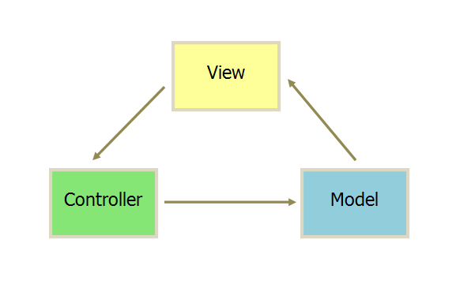
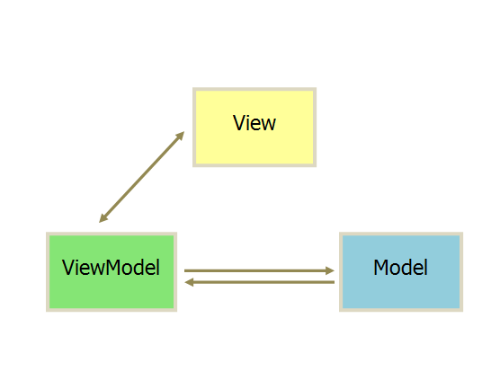

# 编程思想

## 函数式编程

### 基础

##### 函数

- 关注程序的输入和输出;
- 忽略程序的过程;
- 将程序的执行过程抽象为一个函数;

```typescript
// 命令式编程
const array = [0, 1, 2, 3];
for (let i = 0; i < array.length; i++) {
  array[i] = Math.pow(array[i], 2);
}

// 函数式方式
[0, 1, 2, 3].map((num) => Math.pow(num, 2));
```

##### 纯函数

- 数据不可变 + 无状态性 + 固定输入-输出;
  - 无状态性: 不依赖也不会改变外部作用域的变量;
  - 数据不可变: 函数不会改变输入数据;
  - 固定输入-输出: 相同的输入必然是相同的输出;

##### 副作用函数

- 函数本身进行与函数返回值无关的操作, 即修改外部状态;
  - 发送网络请求;
  - 修改 DOM;
  - 事件请求;
  - 本地存储;
  - 状态管理;

### 柯里化

##### 思想

- 把传递多个参数的函数 A 变换成一系列只接受一个参数的函数 B;
- 函数 B 并返回一个函数 C, 函数 C 接受函数 A 的第二个参数, 以此类推;
- 常用于函数式编程;

##### 自定义柯里化

```typescript
const curry = (fn, ...args) => {
  if (fn.length <= args.length) {
    return fn.apply(this, args);
  } else {
    return curry.bind(this, fn, ...args);
  }
};

function sum(a, b, c) {
  return a + b + c;
}

let curriedSum = curry(sum);
console.log(sum(1, 2, 3));
console.log(curriedSum(1, 2, 3));
console.log(curriedSum(1, 2)(3));
console.log(curriedSum(1)(2)(3));
```

### 组合和管道

##### 组合

- 将多个函数组合成一个函数;
- 从右向左执行他的组成函数, 并将上一个的输出作为下一个的输入;

```typescript
const compose = (...fns) => {
  return (x) => {
    return fns.reduceRight((beforeRes, fn) => {
      return fn(beforeRes);
    }, x);
  };
};

const addOne = (x) => x + 1;
const double = (x) => x * 2;
const subtractThree = (x) => x - 3;

const composedFunc = compose(subtractThree, double, addOne);
console.log(composedFunc(3)); // 5
```

##### 管道

- 将多个函数组合成一个函数;
- 从左向右执行他的组成函数, 并将上一个的输出作为下一个的输入;

```typescript
const pipe = (...fns) => {
  return (x) => {
    return fns.reduce((beforeRes, fn) => {
      return fn(beforeRes);
    }, x);
  };
};

const addOne = (x) => x + 1;
const double = (x) => x * 2;
const subtractThree = (x) => x - 3;
const pipedFunc = pipe(addOne, double, subtractThree);
console.log(pipedFunc(3)); // 5
```

### 函数缓存

- 基于柯里化, 闭包和哈希表实现函数缓存;

```typescript
const memoize = function (fn, context) {
  let cache = Object.create(null);
  context = context || window;
  return (...args) => {
    if (!cache[args]) {
      cache[args] = fn.apply(context, args);
    }
    return cache[args];
  };
};

const add = (a, b) => a + b;
const calc = memoize(add);
const num1 = calc(100, 200);
const num2 = calc(100, 200); // 缓存得到的结果
```

## if 优化

##### 口诀

- 互斥条件表驱动;
- 嵌套条件校验链;
  - 同时达成的条件使用 && 结合在一起;
- 短路条件早 return;
- 零散条件可组合;
  - 上面三种条件自定义组合;

##### 互斥条件表驱动

```typescript
// 相互冲突的条件使用表驱动优化
// 利用 key-handler, 通过 key 执行对应 handler;
const day = new Date().getDay()
let day_zh;
if(day === 0){
    day_zh = '星期日'
}else if(day === 1) {
    day_zh = '星期一'
}
...
else{
    day_zh = '星期六'
}
// 表驱动
const week = ['星期日', '星期一',..., '星期六']
const day = new Date().getDay(
const day_zh = week[day]
```

### 递归函数

```typescript
/**
 * 该函数用于数组形式的规则递归节点, 思想很巧妙
 * data 为数据, key 可作为操作中止的判断条件, callback 为操作
 * 首先根据 key (可选) 判断是否满足判断条件
 * 满足则使用 callback 进行操作
 * callback 有 value, index, data 三个参数, 这也算是一个最佳实践, 记住即可
 * 不满足则递归使用 loop 函数, 将其子节点作为新的 data
 * @params data 数据
 * @params key 节点标识属性
 * @params callback 操作
 */
const loop = (
  data: Layer[],
  key: string,
  callback: (value: Layer, index: number, data: Layer[]) => void
) => {
  for (let i = 0; i < data.length; i++) {
    if (data[i].key === key) {
      return callback(data[i], i, data);
    }
    if (data[i].children) {
      loop(data[i].children, key, callback);
    }
  }
};
```

## API 设计

### 前端 API

##### 数据格式

```typescript
interface ApiResponse<T> {
  status: "pending" | "success" | "error";
  data: T;
  message: string;
}
```

##### 自定义 fetch

- fetch 封装一层;
- 便于后续添加逻辑 (鉴权, 登录...);

##### 防腐层

- api 调用中间抽象出一层防腐层;
- 将数据获取的数据或逻辑分类;
- 以便 api 的修改导致业务代码报错;

##### api 错误处理

- 前端只在防腐层中进行错误处理;

### 后端 api

##### 数据格式

```typescript
interface ApiResponse<T> {
  code: number;
  data: T;
  message: string;
}
```

##### 错误处理

- 后端只在 controller 层面进行错误处理;
- 同时写一个全局错误处理处理未捕获的异常;

##### 数据库读写逻辑

- 读写数据, 先操作数据, 再读写数据库;
- 数据读写错误, 要有对应的错误处理;

## 面向对象

### 封装性

- 对象方法和属性包装在对象内部;
- 外界无法直接访问对象内部, 隐藏对象内部细节;
- 对外提供固定接口;

### 继承性

- 子类继承父类, 进而复用父类代码;
- 子类可以重载父类;

### 多态性

- 同一操作作用于不同对象, 产生不同的结果;
- 可通过方法重载, 方法重写实现编译时和运行时的多态性;
- 可通过组合加委托, 在运行时中传入不同接口实现, 实现多态性;

## 前端工程化

##### 目的

- 通过一系列工具和标准规范前端开发流程;
- 目的是提高前端开发效率, 提高代码质量和项目可维护性;

##### 主要内容

- 项目搭建;
  - 自动化项目依赖管理, 构建, 打包, 压缩, 优化等;
    - vite, pnpm 等;
  - 使用 cli 脚手架工具快速生成项目结构;
- 代码质量;
  - 定义编码规范, 编码风格, 提高代码可读性;
  - eslint, prettier 约束代码风格;
  - Typescript 约束代码类型;
- 模块化/组件化;
  - 模块化代码, 高内聚, 低耦合, 提高代码复用性;
  - ESM, CommonJS;
- 测试;
  - 单元测试: Jest, Vitest 单元测试;
  - 端到端测试: Cypress 模拟用户操作;
- 版本控制;
  - 版本控制系统: git 管理代码版本;
  - 分支管理策略: Git Flow, Github Flow 管理开发流程;
- CI/CD;
  - 持续集成和持续部署;
  - 自动化代码检查, 构建, 测试, 部署;

## 软件架构模式

### mvc

##### 组成部分

- Model: 模型;
  - 应用程序的数据模型或业务逻辑;
  - 用于数据的读写操作;
- View: 视图;
  - 用户界面的可视化部分, 负责展示数据;
- Controller: 控制器;
  - Model 和 View 交流媒介;
  - 负责 UI 逻辑和读写 Model;

##### 处理流程

- View 发送指令至 Controller;
- Controller 完成业务逻辑后改变 Model;
- Model 将数据更新至 View;



##### 目标

- 将 UI ,数据和业务逻辑分离;
- 降低代码耦合度, 提高应用程序的可维护性和可测试性;

### mvvm

##### mvvm

- 用于构建用户界面的软件架构模式;

##### 组成部分

- Model: 模型;
  - 应用程序的数据模型或业务逻辑;
  - 用于数据的读写操作;
  - Model 通过 ViewModel 与 UI 交互;
- View: 视图;
  - 用户界面的可视化部分, 负责展示数据;
- ViewModel: 视图模型;
  - Model 和 View 交流媒介;
  - 负责在 Model 提取数据用于 View;
  - 通过数据绑定机制将数据与 View 绑定;
  - 负责 UI 逻辑;
- 数据绑定;
  - ViewModel 与 View 两层之间, 任一一层数据的变化自动反映至另一层;

##### 处理流程

- View 和 ViewModel 的更新通过数据绑定机制双向同步;
- View 无需手动通信 Model;



##### 目标

- 将 UI 逻辑与数据逻辑分离;
- 通过数据绑定实现数据和 UI 的同步;
- 降低代码耦合度, 提高应用程序的可维护性和可测试性;

##### 与 mvc 的区别

- 低耦合;
  - mvvm 将 UI 和数据完全解耦, view 和 Model 不知道对方存在;
  - View 和 Model 可以独立于对方变化;
- 数据绑定;
  - 具有数据绑定机制, 实现了 View 和 ViewModel 的自动同步;
  - 无需手动更新 View;
