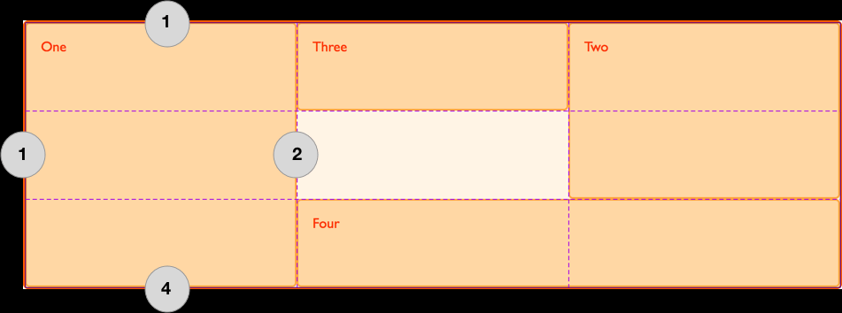

# grid

## grid 布局

##### 组成部分

- rows;
- columns;
- gutters: columns 和 rows 之间的空隙.

##### 示意图


### grid 属性值

##### 作用

- 容器创建 grid 布局.

##### 语法格式

```css
.container {
  display: grid;
}
```

### grid-template-rows 属性

##### 作用

- 设置 grid 行名;
- 设置 grid 行轨道大小.

##### 语法格式

```css
.container {
  grid-template-rows: 1fr 2fr 1fr;
}

.container {
  grid-template-rows: [linename1] 100px [linename2 linename3];
}
```

##### 机制

- 依次设置,
- 空格分隔.

#### 属性值

##### none

- 使用 grid-auto-rows 属性.

##### [linename]

- 设置 grid 行名,
- 名称除保留字之外的有效字符串,
- 同一行可取多个行名,
- 包裹在同一[] 下,
- , 分隔.

```css
.container {
  grid-template-rows: [linename1] 100px [linename2 linename3];
}
```

##### \<length\> 类型

- 非负值.

##### \<percentage\> 类型

- 非负值.

##### \<flex\> 类型

- 非负值,
- 设置各轨道 flex 比例系数,
- fr 后缀,
- 单独使用视为 minmax(auto, \<flex\>).

##### max-content

- 设置尽可能大的最大宽度;

##### min-content

- 设置尽可能大的最小宽度.

##### minmax(min, max)

- 不作详述.

##### auto

- 单独使用视为 minmax(min-content,max-content).

##### repeat()

- 不作详述.

### grid-template-columns 属性

##### grid-template-columns 属性

- 同 grid-template-rows 属性,
- 将行换做列即可.

### grid-auto-rows 属性

##### 机制

- 当无 grid-template-rows 属性,
- 或其属性值为 none 时,
- 自动使用 grid-auto-rows 属性.

##### 语法格式

```css
#grid {
  display: grid;
  grid-auto-rows: 100px;
}
```

#### 属性值

##### \<length\> 类型

- 非负值.

##### \<percentage\> 类型

- 非负值.

##### \<flex\> 类型

- 非负值,
- 设置各轨道 flex 比例系数,
- fr 后缀,
- 单独使用视为 minmax(auto, \<flex\>).

##### max-content

- 设置尽可能大的最大宽度;

##### min-content

- 设置尽可能大的最小宽度.

##### minmax(min, max)

- 不作详述.

##### auto

- 单独使用视为 minmax(min-content,max-content).

### grid-auto-columns 属性

##### grid-auto-columns 属性

- 同 grid-auto-rows 属性,
- 将行换做列即可.

### repeat() 函数

##### 作用

- 作为 grid-template-rows(columns) 的属性值,
- 使用更简洁的方式表示重复的 track list 参数.

##### 语法格式

- repeat count + tracks.
  - repeat count;
    - int;
    - auto-fill;
    - auto-fit.
  - tracks.
    - tracks size.
- 可存在多个 tracks sizes,
  - 空格分隔,
  - 表示依次重复多个 tracks sizes.

```css
#container {
  display: grid;
  grid-template-columns: repeat(2, 50px 1fr) 100px;
}
```

##### 尽可能多的列

- 使用 repeat() 函数,
- 使用 auto-fill,
- 使用 minmax(),
  - 第一个参数为设置的最小值,
  - 第二个参数为 1fr, 自动拉伸.

```css
.container {
  display: grid;
  grid-template-columns: repeat(auto-fill, minmax(200px, 1fr));
}
```

#### 属性值

##### \<flex\> 类型

- 非负值.

##### \<length\> 类型

- 非负值.

##### [linename]

- 设置 grid 行名,
- 名称除保留字之外的有效字符串,
- 同一行可取多个行名,
- 包裹在同一[] 下,
- , 分隔.

##### \<percentage\> 类型

- 非负值.

##### auto

- 用于 minmax() 函数.

##### auto-fill 和 auto-fit

- 相同之处,
  - 设置重复次数为尽可能大的数字,
  - 使对应方向不会溢出,
  - 最小为 1.
- 不同之处,
  - 当容器宽度大于所有重复子元素的总宽度,
  - auto-fill 保留空白通道,
  - auto-fit 折叠空白通道.
    - 空白通道空间平均分配给其他通道.

##### max-content

- 设置尽可能大的最大宽度;

##### min-content

- 设置尽可能大的最小宽度.

##### minmax(min, max)

- 不作详述.

### minmax()

##### 作用

- 用于 gird 布局,
- 设置最大最小值范围.

##### 语法格式

- minmax(min,max).

```css
#container {
  display: grid;
  grid-template-columns: minmax(min-content, 300px) minmax(200px, 1fr) 150px;
}
```

#### 属性值

##### \<length\> 类型

- 非负值.

##### \<percentage\> 类型

- 非负值.

##### \<flex\> 类型

- 非负值.

##### max-content

- 设置尽可能大的最大宽度;

##### min-content

- 设置尽可能大的最小宽度.

##### auto

- 作为最大值: max-content;
- 作为最小值: min-content.

### gap 属性

##### 作用

- 设置 flex/gird/multiple column 布局 gutters 尺寸.

##### 语法格式

```css
#flexbox {
  display: flex;
  gap: 20px 5px;
}
```

##### 成分属性

- row-gap;
- column-gap.

##### 简写机制

- 1 value;
  - gap
  - row-gap = column-gap = gap.
- 2 value:
  - row-gap column-gap.

### column-gap 属性

##### column-gap 属性

- 见 multiple columns.

### row-gap 属性

##### row-gap 属性

- 同 column-gap 属性,
- 将列换做行即可.

## 基于网格线的放置

### grid-column 属性

##### 作用

- 设置 grid item 基于 grid column 的位置和尺寸.

##### 定位机制



##### 语法格式

```css
#item {
  grid-column: 2 / 4;
}
```

##### 成分属性

- grid-column-end;
- grid-column-start.

##### 简写机制

- 1 value;
  - grid-colum-start.
- 2 value;
  - gird-colum-start / grid-colum-start.

### grid-column-start 属性

##### 作用

- 设置 grid item 基于 grid column 的起始位置和尺寸.

##### 语法格式

```css
#item {
  grid-column-start: span 2;
}
```

#### 属性值

##### auto

- 默认值,
- 默认 span 为 1.

##### integer

- 可正可负.
  - 正数: 基于正数第 i 列;
  - 负数: 基于倒数第 i 列 .

##### span

- span [int],
- 若省略 int,
- 默认为 1,
- 表示 grid 横跨 int 个列,
- 单独使用时,
- `grid-column-start: span 2` 等效于 `grid-column: i / span 2`.

```css
#item {
  grid-column-start: 1 / span 2;
}
```

##### custom-ident

- 不作详述.

### grid-column-end 属性

##### grid-column-end 属性

- 同 grid-colum-start 属性,
- 表示终止位置.

### grid-row 属性

##### grid-row

- 同 grid-column,
- 把列换成行.

### grid-row-start 属性

##### grid-row-start 属性

- 同 grid-colum-start 属性,
- 把列换成行.

### grid-row-end 属性

##### grid-row-end 属性

- 同 grid-colum-end 属性,
- 把列换成行.

## 网格区域命名

### grid-template-areas 属性

##### 作用

- 容器命名网格区域, 即 custom-ident.

##### 语法格式

- 同一行同一引号包裹,
- 同一行不同列空格分隔.
- 不同行引号分隔.

```css
#page {
  display: grid;
  width: 100%;
  height: 250px;
  grid-template-areas:
    "a a ."
    "a a ."
    ". b c";
  grid-template-rows: 50px 1fr 30px;
  grid-template-columns: 150px 1fr;
}
```

##### 原则

- 一旦使用, 必须填充所有网格;
- 使用 . 视为该网格不命名;
- 命名网格区域必须为矩形;
- 同一命名网格必须相连.

#### 属性值

##### none

- 不定义 grid areas.

##### string

- 除标识符外的有效字符串.

### grid-area 属性

##### 作用

- 指定 grid item 的命名网格区域;
- 设置 grid item 基于 grid column/row 的位置和尺寸.

##### 语法格式

- 指定 grid item 的命名网格区域;
  - grid-area: custom-ident.
- 设置 grid item 基于 grid column/row 的位置和尺寸.
  - grid-row-start / grid-column-start / grid-row-end / grid-column-end.

```css
/* 指定 grid item 的命名网格区域 */
#page {
  display: grid;
  width: 100%;
  height: 250px;
  grid-template-areas:
    "a a ."
    "a a ."
    ". b c";
  grid-template-rows: 50px 1fr 30px;
  grid-template-columns: 150px 1fr;
}
#item1 {
  grid-area: a;
}
/* 设置 grid item 基于 grid column/row 的位置和尺寸 */
#item1 {
  grid-area: 2 / 2 / auto / span 3;
}
```
