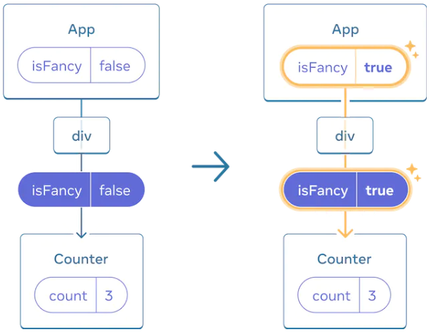

# react hook

## useState

### 基础

##### 基本使用

```typescript
import { useState } from "react";

// state: 当前状态
// setState: 更新状态函数
// initialState: 初始状态
const [state, setState] = useState(initialState);
```

##### 私有性

- 同一组件的多个实例的 state 是相互独立隔绝的;

### 传递 state

- 把 state 添加至多个组件共同的父组件;
- 通过 event handle 作为属性将 setFunction 传递给子组件;
- 使子组件改变父组件的 state;

### 更新 object 和 array

##### 更新机制

- array 和 object 在 react 是 mutable, 但你要视其为 readonly;
- 不能改变在 state 中已经存在的 array 或 object;
  - 改变了也没有什么作用;
  - 因为仅仅改变的是快照;

##### 更新方法

- 使用 ... 操作符创建 object 副本;
  - 嵌套对象需要嵌套使用 ... 操作符;
- 使用 ...操作符, contact(), filter(), slice() 和 map() 方法创建 array 副本;

### state 更新机制

- 由于 react 快照机制;
- set 函数不会实时更新中的 state;
- 只有在下一次渲染中 state 才会更新;

```typescript
function handleClick() {
  setAge(age + 1); // setAge(42 + 1)
  setAge(age + 1); // setAge(42 + 1)
  setAge(age + 1); // setAge(42 + 1)
}
```

### updater function

##### updater function

- 突破闭包, 访问最新 state;
- 使用前一个语句的返回值进行更新计算;

```typescript
<button
  onClick={() => {
    setNumber((n) => n + 1); // setNumber(0 + 1);
    setNumber((n) => n + 1); // setNumber(1 + 1);
    // 结果为 2
  }}
></button>
```

##### 命名规范

- state 的首字母命名其函数参数;

```typescript
setEnabled((e) => !e);
setLastName((ln) => ln.reverse());
setFriendCount((fc) => fc * 2);
```

### 重置 State

##### state 存储机制

- state 根据其对应的 component 在 UI Tree 中的位置;
- 存储在 UI Tree 的对应位置中;
- 不同实例中的相同 state 是相互隔离的


##### state 重置机制

- state 只有在 UI tree 中的位置发生变化或移除时;
- state 才会在 react 下一次渲染中重置;
- 只要是同一组件, 且在 UI Tree 中位置不变, 无论该位置的组件是否为同一实例;
- react 就视其为同一个实例, 所在位置的 state 值不会发生重置;



##### 重置同一逻辑位置的 state

- 在不同物理位置渲染同一组件的不同实例;
- 设置 key 属性标识;

```typescript
// 在不同物理位置渲染同一组件的不同实例
const Scoreboard = ()=> {
  const [isPlayerA, setIsPlayerA] = useState(true);
  return (
    <div>
      {isPlayerA && <Counter person="Taylor" />}
      {!isPlayerA && <Counter person="Sarah" />}
      <button onClick={() => setIsPlayerA(!isPlayerA);}>Next player!</button>
    </div>
  );
}
// 设置 key 属性
const Scoreboard = () => {
  const [isPlayerA, setIsPlayerA] = useState(true);
  return (
    <div>
      {isPlayerA ? <Counter key="Taylor" person="Taylor" /> : <Counter key="Sarah" person="Sarah" />}
      <button onClick={() => setIsPlayerA(!isPlayerA);}>Next player!</button>
    </div>
  );
}
```

### State 设计原则

```typescript
// 合并相似变量
const [x, setX] = useState(0);
const [y, setY] = useState(0);
const [position, setPosition] = useState({ x: 0, y: 0 });
// 避免相互矛盾状态
const [isOpen, setIsOpen] = useState(true);
const [isClose, setIsClose] = useState(false);
const [status, setStatus] = useState("open");
// 避免不必要 state
const [firstName, setFirstName] = useState("");
const [lastName, setLastName] = useState("");
const [fullName, setFullName] = useState("");
const [firstName, setFirstName] = useState("");
const [lastName, setLastName] = useState("");
const fullName = firstName + " " + lastName;
// 避免不同 state 之间重复存储相同数据
const [items, setItems] = useState(initialItems);
const [selectedItem, setSelectedItem] = useState(items[0]);
const [items, setItems] = useState(initialItems);
const [selectedId, setSelectedId] = useState(0);
// 避免过多层级
earth = {
  id: 0;
  child: [
    {
      id: 1;
      child: [
        {
          id: 2;
        };
      ];
    };
  ];
};
```

## useReducer

### 基本使用

```typescript
import { useReducer } from "react";

function reducer(state, action) {
  // ...
}

function MyComponent() {
  // state: 当前状态
  // dispatch: 状态更新函数
  // reducer: 状态处理函数
  // initialArg: 初始状态
  const [state, dispatch] = useReducer(reducer, initialArg);
  // ...
}
```

### dispatch

- 更新状态函数;
- 内嵌一个自定义对象 (可选), 标识更新操作;
  - 惯例使用 type 属性;

```typescript
function handleDeleteTask(taskId) {
  dispatch(
    {
      type: "deleted";
      id: taskId;
    }
  );
}
```

### reducer

- 状态处理函数;
- 第一个参数为 state 本身, 第二个参数为 dispatch 传递对象 (可选);
- 根据 dispatch 对象执行不同操作;

```typescript
function reducer(state, action) {
  switch (action.type) {
    case "added": {
      // ...
    }
    case "deleted": {
      // ...
    }
    default: {
      // ...
    }
  }
}
```

### useState 和 useReducer 的异同

##### 相同

- 相同的快照机制;

##### useState

- 适用于简单状态;

##### useReducer

- 适用于复杂状态;
  - useReducer 具有更少的代码量;
  - useReducer 具有更好的可读性;
  - useReducer 具有更容易调试;
  - useReducer 具有更容易测试;

## useContext

### createContext

- 创建 context;
- 大驼峰命名;

```typescript
import { createContext } from "react";

// initialValue: context 初始值
export const LevelContext = createContext(initialValue);
```

### LevelContext

- 定义 context;

```typescript
import { LevelContext } from "./LevelContext.js";

export default function Section({ level, children }) {
  return (
    <section className="section">
      <LevelContext.Provider value={level}>{children}</LevelContext.Provider>
    </section>
  );
}
```

### useContext

- 使用 useContext;

```typescript
import { useContext } from "react";
import { LevelContext } from "./LevelContext.js";

export default function Heading({ children }) {
  const level = useContext(LevelContext);
  // ..;
}
```

### Context 运算机制

- context 可基于其层级进行运算;

```typescript
export default function Section({ children }) {
  const level = useContext(LevelContext);
  return (
    <section className="section">
      <LevelContext.Provider value={level + 1}>
        {children}
      </LevelContext.Provider>
    </section>
  );
}
```

## useRef

### 基础

##### 定义 ref

```typescript
import { useRef } from "react";
const App = () => {
  const ref = useRef(0);
  //...
};
```

##### 使用 useRef

```typescript
import { useRef } from "react";
const App = () => {
  const ref = useRef(0);
  //...
  const value = ref.current;
  ref.current = newValue;
};
```

### useRef 的特性

- 使用 ref.current 读写 ref;
- 改变 ref 不触发渲染;
- ref 突破快照, 实时更新, 读写最新值;
- 渲染过程中无法读取 ref;

```typescript
function MyComponent() {
  // Don't write a ref during rendering
  myRef.current = 123;

  useEffect(() => {
    // You can read or write refs in effects
    myRef.current = 123;
  });

  function handleClick() {
    // You can read or write refs in event handlers
    doSomething(myOtherRef.current);
  }

  // Don't read a ref during rendering
  return <h1>{myOtherRef.current}</h1>;
}
```

### 传递 ref

- ref 为引用类型, ref.current 为值类型;
- 传递 ref.current 不会导致 ref 的改变;

### 操作 DOM

##### 基本使用

```typescript
import { useRef } from "react";
const App = () => {
  const inputRef = useRef(null);
  function handleClick() {
    inputRef.current.focus();
  }
  return (
    <>
      <input ref={inputRef} />
      <button onClick={handleClick}>Focus the input</button>
    </>
};
```

##### 传递 ref 对应 dom

- react 不允件引用其他组件的 DOM 节点;
- 若要引用, 使用 forwardRef hook;

```typescript
import { forwardRef, useRef } from "react";

const MyInput = forwardRef((props, ref) => {
  return <input {...props} ref={ref} />;
});

export default function Form() {
  const inputRef = useRef(null);

  function handleClick() {
    inputRef.current.focus();
  }

  return (
    <>
      <MyInput ref={inputRef} />
      <button onClick={handleClick}>Focus the input</button>
    </>
  );
}
```
