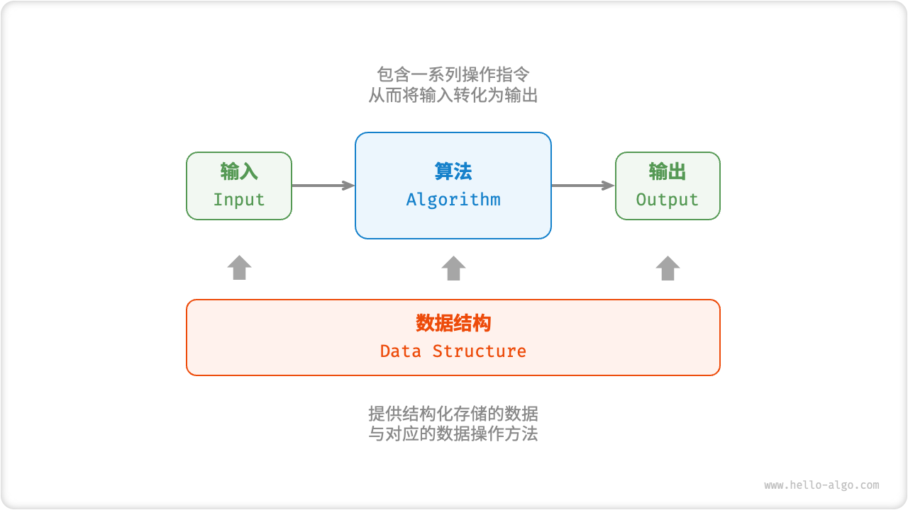
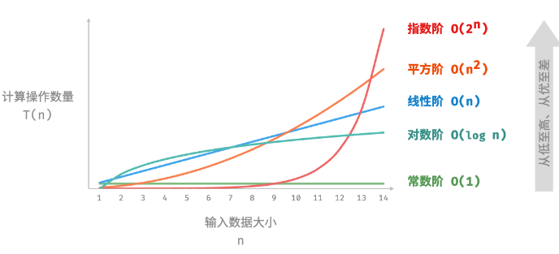
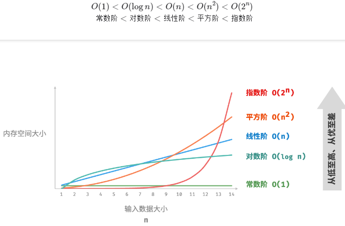

# 绪论

## 算法

##### 算法

- 特定计算机模型;
- 解决特定问题的指令序列;

##### 算法的特征

- 输入 + 输出;
- 正确性: 可以解决特定问题;
- 确定性: 描述为指令序列;
- 可行性: 可在常数时间内完成;
- 有穷性: 任何输入, 经过有穷次操作, 都可得到输出;

##### 数据结构

- 计算机中组织和存储数据的方式;

##### 数据结构和算法的关系



## 复杂度

### 时间复杂度

##### 时间复杂度

- 依次为最差时间复杂度, 最佳时间复杂度, 平均时间复杂度;

$T(n) = \Omicron(f(n)) \qquad if \exist c>0 \qquad s.t. \quad T(n) < c \cdot f(n) \qquad \forall n \gg 2$
$T(n) = \Omega(f(n)) \qquad if \exist c>0 \qquad s.t. \quad T(n) > c \cdot f(n) \qquad \forall n \gg 2$
$T(n) = \Theta(f(n)) \qquad if \exist c_1>c_2>0 \qquad s.t. \quad c_1 \cdot f(n) > T(n) > c_2 \cdot f(n) \qquad \forall n \gg 2$

##### 层次划分




##### 时间复杂度的计算

- for 循环: 运行时间 \* 迭代次数;
- 嵌套 for 循环: for 循环的乘积;
- 顺序语句: 时间求和;
- 条件语句: 对应块中的最大运行时间;

##### 常数阶

```typescript
function constant(n) {
  let count = 0;
  const size = 100000;
  for (let i = 0; i < size; i++) count++;
  return count;
}
```

##### 线性阶

```typescript
// 常见于单层循环
function linear(n) {
  let count = 0;
  for (let i = 0; i < n; i++) count++;
  return count;
}
```

##### 平方阶

```typescript
// 常见于嵌套循环
function quadratic(n) {
  let count = 0;
  for (let i = 0; i < n; i++) {
    for (let j = 0; j < n; j++) {
      count++;
    }
  }
  return count;
}
```

##### 指数阶

```typescript
// 常见于循环枚举
function exponential(n) {
  let count = 0,
    base = 1;
  for (let i = 0; i < n; i++) {
    for (let j = 0; j < base; j++) {
      count++;
    }
    base *= 2;
  }
  return count;
}
```

##### 对数阶

```typescript
// 常见于二分查找或分治算法
function logarithmic(n) {
  let count = 0;
  while (n > 1) {
    n = n / 2;
    count++;
  }
  return count;
}
```

##### 线性对数阶

```typescript
// 常见于嵌套循环
function linearLogRecur(n) {
  if (n <= 1) return 1;
  let count = linearLogRecur(n / 2) + linearLogRecur(n / 2);
  for (let i = 0; i < n; i++) {
    count++;
  }
  return count;
}
```

##### 阶乘阶

```typescript
// 常见于递归
function factorialRecur(n) {
  if (n == 0) return 1;
  let count = 0;
  for (let i = 0; i < n; i++) {
    count += factorialRecur(n - 1);
  }
  return count;
}
```

### 空间复杂度

##### 相关空间

- 输入空间: 存储输入数据;
- 暂存空间: 存储运行数据;
- 输出空间: 存储输出数据;

##### 计算方法

- 以最差输入数据为准;
- 以峰值内存为准;

##### 常见类型



##### 常数阶

```typescript
// 常见于与输入数据无关的变量, 对象
function constant(n) {
  // 常量, 变量, 对象占用 O(1) 空间
  const a = 0;
  const b = 0;
  const nums = new Array(10000);
  const node = new ListNode(0);
  // 循环中的变量占用 O(1) 空间
  for (let i = 0; i < n; i++) {
    const c = 0;
  }
  // 循环中的函数占用 O(1) 空间
  for (let i = 0; i < n; i++) {
    constFunc();
  }
}
```

##### 线性阶

```typescript
// 常见于与输入数据有关的数组, 表, 栈, 队列等
function linear(n) {
  // 长度为 n 的数组占用 O(n) 空间
  const nums = new Array(n);
  // 长度为 n 的列表占用 O(n) 空间
  const nodes = [];
  for (let i = 0; i < n; i++) {
    nodes.push(new ListNode(i));
  }
  // 长度为 n 的哈希表占用 O(n) 空间
  const map = new Map();
  for (let i = 0; i < n; i++) {
    map.set(i, i.toString());
  }
}
```

##### 平方阶

```typescript
// 常见于矩阵, 图
function quadratic(n) {
  // 矩阵占用 O(n^2) 空间
  const numMatrix = Array(n)
    .fill(null)
    .map(() => Array(n).fill(null));
  // 二维列表占用 O(n^2) 空间
  const numList = [];
  for (let i = 0; i < n; i++) {
    const tmp = [];
    for (let j = 0; j < n; j++) {
      tmp.push(0);
    }
    numList.push(tmp);
  }
}
```

##### 指数阶

```typescript
// 常见于二叉树
function buildTree(n) {
  if (n === 0) return null;
  const root = new TreeNode(0);
  root.left = buildTree(n - 1);
  root.right = buildTree(n - 1);
  return root;
}
```

##### 对数阶

- 常见于分治算法和数据类型转化;

## 数据结构

### 逻辑结构

##### 线性结构

- 数组;
- 链表;
- 栈;
- 队列;
- 哈希表;

##### 非线性结构

- 树形结构;
  - 树;
  - 堆;
  - 哈希表;
- 网状结构;
  - 图;

### 物理结构

##### 连续空间存储和离散空间存储

- 存储数组的内存空间是连续的;
- 存储链表的内存空间是离散的;


##### 可基于数组实现的数据结构

- 栈 + 队列 + 哈希表 + 树 + 堆 + 图 + 矩阵;

##### 可基于链表实现的数据结构

- 栈 + 队列 + 哈希表 + 树 + 堆;
