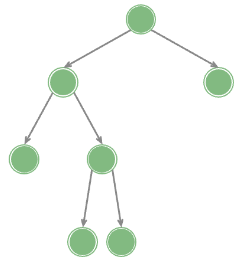
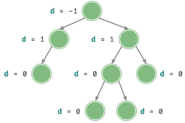
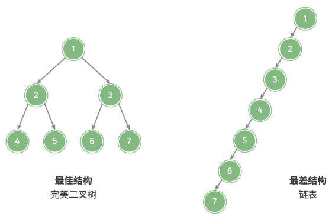
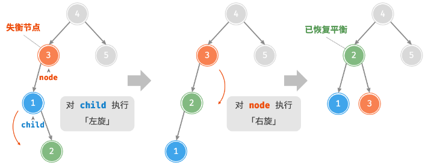

# 树

## 二叉树

### 基础

##### 二叉树

- 非线性数据结构;
- 最多两个子节点, 依次为左子节点和右子节点;
- 对应的树称为左子树和右子树;

##### 常见术语

- 根节点: 树的顶部节点;
- 叶节点: 没有子节点的节点;
- 层: 从顶到底递增, 根节点为 1;
- 度: 节点的子节点数量;
- 边: 连接两个节点的线段;
- 高度: 根节点到最远节点的边的数量;
- 深度: 根节点到该节点的边的数量;


### 常见二叉树类型

##### 完美二叉树

- 所有层的节点被填满;


##### 完全二叉树

- 只有最底层的节点没有填满;
- 最底层节点向左靠;


##### 完满二叉树

- 除叶节点之外的节点都有两个子节点;



##### 平衡二叉树

- 左子树和右子树高度之差不超过 1;



### 二叉树的退化

##### 二叉树的退化

- 所有节点偏向一侧, 退化为链表;



## 二叉树遍历

### 层序遍历

##### 层序遍历

- 广度优先遍历;
- 时间复杂度为 O(n);
- 空间复杂度为 O(n);


### 前序, 中序, 后序遍历

##### 前序, 中序, 后序遍历

- 深度优先遍历;
- 时间复杂度为 O(n);
- 空间复杂度为 O(n);


```typescript
function preOrder(root: BinarySearchTreeNode): BinarySearchTreeNode[] {
  const list: BinarySearchTreeNode[] = [];
  const loop = (node: BinarySearchTreeNode) => {
    list.push(node);
    if (node._left) {
      loop(node._left);
    }
    if (node._right) {
      loop(node._right);
    }
  };
  loop(root);
  return list;
}

function inOrder(root: BinarySearchTreeNode): BinarySearchTreeNode[] {
  const list: BinarySearchTreeNode[] = [];
  const loop = (node: BinarySearchTreeNode) => {
    if (node._left) {
      loop(node._left);
    }
    list.push(node);
    if (node._right) {
      loop(node._right);
    }
  };
  loop(root);
  return list;
}

function postOrder(root: BinarySearchTreeNode): BinarySearchTreeNode[] {
  const list: BinarySearchTreeNode[] = [];
  const loop = (node: BinarySearchTreeNode) => {
    if (node._left) {
      loop(node._left);
    }
    if (node._right) {
      loop(node._right);
    }
    list.push(node);
  };
  loop(root);
  return list;
}
```

## 二叉树数组表示

##### 完美二叉树


##### 任意二叉树


##### 优点

- 遍历, 访问速度快;
- 允许随机访问;

##### 缺点

- 不适合存储过大的树;
- 插入和删除效率低;
- 存在大量空节点时, 空间利用率低;

## 二叉搜索树

### 基础

##### 二叉搜索树

- 左子树所有节点值 < 根子树节点值 < 右子树所有节点值;

### 二叉搜索树的操作

##### 查找节点

- 从根节点出发;
- 循环比较节点值;
  - 小于节点值: 寻找左子树;
  - 等于节点值: 目标节点;
  - 大于节点值: 寻找右子树;

```typescript
function find(value: number): BinarySearchTreeNode | null {
  if (this._value === null) return null;
  if (this._value === value) return this;
  if (this._left && this._value > value) {
    return this._left.find(value);
  }
  if (this._right && this._value < value) {
    return this._right.find(value);
  }
  return null;
}
```

##### 插入节点

- 查找插入位置: 同查找节点;
- 插入节点: 若已存在, 不插入;

```typescript
function insert(value: number): boolean {
  if (this._value === null) {
    this._value = value;
    return true;
  }

  if (this._value > value) {
    if (this._left === null) {
      this._left = new BinarySearchTreeNode(value);
      this._left._parent = this;
      return true;
    }
    this._left.insert(value);
    return true;
  }

  if (this._value < value) {
    if (this._right === null) {
      this._right = new BinarySearchTreeNode(value);
      this._right._parent = this;
      return true;
    }
    this._right.insert(value);
    return true;
  }

  return false;
}
```

##### 删除节点

- 查找插入位置: 同查找节点;
- 删除节点;
  - 叶子节点: 直接删除;
  - 删除节点度为 1;
    - 删除节点值替换为子节点;
    - 删除子节点;
  - 删除节点度为 2;
    - 寻找右子树最小节点;
    - 删除节点值替换为最小节点;
    - 删除最小节点;

```typescript
function remove(value: number): boolean {
  const node = this.find(value);
  if (node === null) return false;
  // 2
  if (node._left && node._right) {
    const minNode = node._right.findMin();
    node._value = minNode._value;
    if (minNode._right) {
      (minNode._parent as BinarySearchTreeNode)._left = minNode._right;
      minNode._right._parent = minNode._parent as BinarySearchTreeNode;
      minNode._right = null;
    }
    minNode._parent = null;
    return true;
  }
  // 0
  if (!node._left && !node._right) {
    if (node._parent) {
      if (node._parent._left?._value === value) node._parent._left = null;
      if (node._parent._right?._value === value) node._parent._right = null;
    }
    node._parent = null;
    return true;
  }
  // 1
  if (node._left) {
    node._value = node._left._value;
    node._left._parent = null;
    node._left = null;
  }
  if (node._right) {
    node._value = node._right._value;
    node._right._parent = null;
    node._right = null;
  }
  return true;
}
```

### 二叉搜索树的效率

##### 理想情况

|      | 时间复杂度 |
| ---- | ---------- |
| 查找 | $\log n$   |
| 插入 | $\log n$   |
| 删除 | $\log n$   |

##### 退化情况

|      | 时间复杂度 |
| ---- | ---------- |
| 查找 | n          |
| 插入 | n          |
| 删除 | n          |

## AVL 树

### 基础

##### 节点高度

- 节点到最远叶节点的距离;
- 叶节点高度为 0;
- 空节点高度为 -1;

```typescript
  get leftHeight ():number {
    if (!this._left) return 0
    return this._left.height + 1
  }

  get rightHeight ():number {
    if (!this._right) return 0
    return this._right.height + 1
  }

  get height () {
    return Math.max(this.leftHeight, this.rightHeight)
  }
```

##### 高度平衡因子

- 左子树高度 - 右子树高度;
- 空节点平衡因子为 0;
- AVL 树中, 高度平衡因子范围为 [-1, 1]

### 旋转

##### 失衡节点

- 高度平衡因子绝对值大于 1 的节点;

```typescript
function balance(node: AVLTreeNode) {
  if (node.leftHeight - node.rightHeight > 1) {
    const children = node._left as AVLTreeNode;
    if (children.leftHeight > children.rightHeight) {
      this.rightRotate(node);
    } else {
      this.leftRightRotate(node);
    }
    return true;
  } else if (node.leftHeight - node.rightHeight < -1) {
    const children = node._right as AVLTreeNode;
    if (children.leftHeight > children.rightHeight) {
      this.rightLeftRotate(node);
    } else {
      this.leftRotate(node);
    }
    return true;
  } else {
    return false;
  }
}
```

##### 右旋


```typescript
function rightRotate(node: AVLTreeNode) {
  const parent = node._parent;
  const children = node._left as AVLTreeNode;
  node._parent = children;
  if (children._right) {
    node._left = children._right;
    children._right._parent = node;
  } else {
    node._left = null;
  }
  children._right = node;
  if (parent) {
    children._parent = parent;
    parent._left = children;
  } else {
    children._parent = null;
    this._root = children;
  }
}
```

##### 左旋


```typescript
function leftRotate(node: AVLTreeNode) {
  const parent = node._parent;
  const children = node._right as AVLTreeNode;
  node._parent = children;
  if (children._left) {
    node._right = children._left;
    children._left._parent = node;
  } else {
    node._right = null;
  }
  children._left = node;
  if (parent) {
    children._parent = parent;
    parent._right = children;
  } else {
    children._parent = null;
    this._root = children;
  }
}
```

##### 先左旋后右旋



```typescript
function leftRightRotate(node: AVLTreeNode) {
  const children = node._left as AVLTreeNode;
  const grandChildren = children._right as AVLTreeNode;
  children._parent = grandChildren;
  children._right = null;
  grandChildren._left = children;
  grandChildren._parent = node;
  node._left = grandChildren;
  this.rightRotate(node);
}
```

##### 先右旋后左旋


```typescript
function rightLeftRotate(node: AVLTreeNode) {
  const children = node._right as AVLTreeNode;
  const grandChildren = children._left as AVLTreeNode;
  children._parent = grandChildren;
  children._left = null;
  grandChildren._right = children;
  grandChildren._parent = node;
  node._right = grandChildren;
  this.leftRotate(node);
}
```

##### 旋转的选择


### AVL 树常用操作

##### 查找节点

- 同二叉搜索树;

##### 插入节点

- 同二叉搜索树插入节点;
- 插入节点后从底到顶寻找第一个失衡节点进行旋转;

```typescript
function insert(value: number) {
  this._root.insert(value);
  let currentNode = this._root.find(value);
  while (currentNode) {
    if (this.balance(currentNode)) break;
    currentNode = currentNode._parent;
  }
}
```

##### 删除节点

- 同二叉搜索树删除节点;
- 删除节点后对根节点进行旋转;

```typescript
function remove(value: number) {
  this._root.delete(value);
  this.balance(this._root);
}
```
