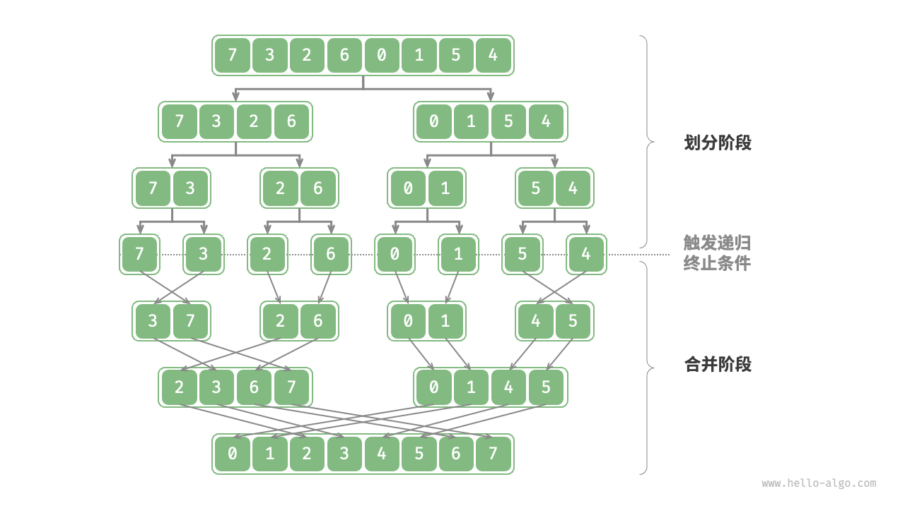
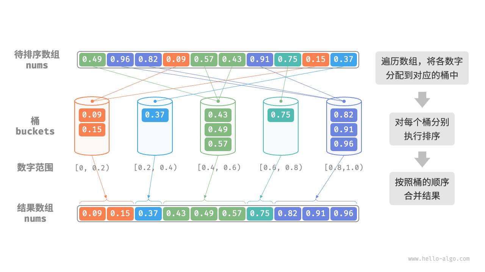
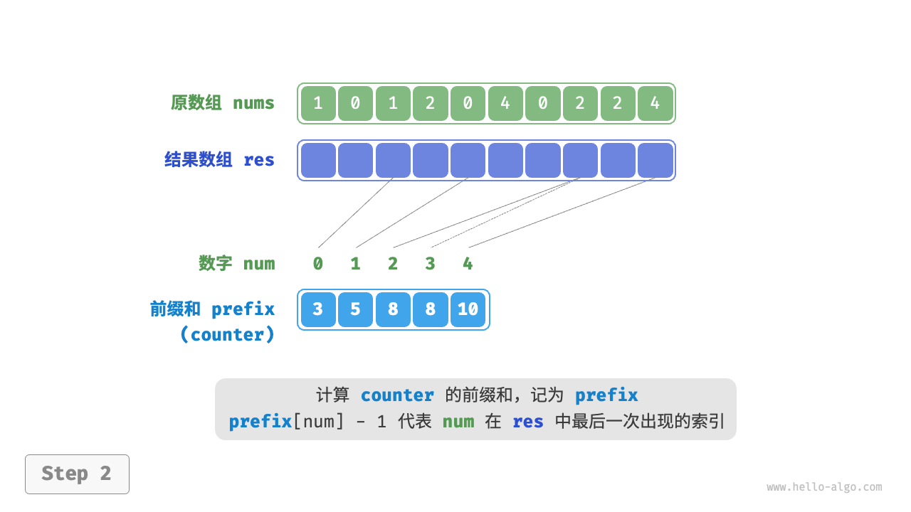

# 排序

## 选择排序

##### 工作原理

- 数组长度为 n;
- 选择 [0, n-1] 中最小的元素, 与 0 处元素交换;
- 选择 [1, n-1] 中最小的元素, 与 1 处元素交换;
- 依次类推, 重复 n - 1 轮;

##### 算法特性

- 时间复杂度: O(n^2);
- 空间复杂度: O(1);
- 非稳定排序;

##### 代码

```typescript
/* 选择排序 */
function selectionSort(nums: number[]): void {
  let n = nums.length;
  // 外循环：未排序区间为 [i, n-1]
  for (let i = 0; i < n - 1; i++) {
    // 内循环：找到未排序区间内的最小元素
    let k = i;
    for (let j = i + 1; j < n; j++) {
      if (nums[j] < nums[k]) {
        k = j; // 记录最小元素的索引
      }
    }
    // 将该最小元素与未排序区间的首个元素交换
    [nums[i], nums[k]] = [nums[k], nums[i]];
  }
}
```

## 冒泡排序

##### 工作原理

- 从数组最左端开始向右遍历, 若'左元素>右元素', 交换两者;
- 数组长度为 n;
- 首先对 n 个元素进行冒泡, 最大元素交换至最后位置;
- 其次对 n -1 个元素进行冒泡, 第二大元素交换至倒数第二位置;
- 依次类推, 重复 n - 1 轮;

##### 算法特性

- 时间复杂度: O(n^2);
- 空间复杂度: O(1);
- 稳定排序;

##### 代码

```typescript
/* 冒泡排序 */
function bubbleSort(nums: number[]): void {
  // 外循环：未排序区间为 [0, i]
  for (let i = nums.length - 1; i > 0; i--) {
    // 内循环：将未排序区间 [0, i] 中的最大元素交换至该区间的最右端
    for (let j = 0; j < i; j++) {
      if (nums[j] > nums[j + 1]) {
        // 交换 nums[j] 与 nums[j + 1]
        let tmp = nums[j];
        nums[j] = nums[j + 1];
        nums[j + 1] = tmp;
      }
    }
  }
}
```

## 插入排序

##### 工作原理

- 数组长度为 n;
- 数组第 1 个元素已完成排序;
- 选取数组第 2 个元素, 与排序部分 (第 1 个元素) 比较, 插入正确位置;
- 选取数组第 3 个元素, 与排序部分 (前 2 个元素) 比较, 插入正确位置;
- 依次类推, 重复 n - 1 次;

##### 算法特性

- 时间复杂度: O(n^2);
- 空间复杂度: O(1);
- 稳定排序;

##### 插入排序优势

- 适用于小数据量;
- 冒泡排序涉及交换元素, 开销高;
- 选择排序不稳定;

##### 代码

```typescript
/* 插入排序 */
function insertionSort(nums: number[]): void {
  // 外循环：已排序元素数量为 1, 2, ..., n
  for (let i = 1; i < nums.length; i++) {
    const base = nums[i];
    let j = i - 1;
    // 内循环：将 base 插入到已排序部分的正确位置
    while (j >= 0 && nums[j] > base) {
      nums[j + 1] = nums[j]; // 将 nums[j] 向右移动一位
      j--;
    }
    nums[j + 1] = base; // 将 base 赋值到正确位置
  }
}
```

## 快速排序

##### 哨兵划分

- 选取数组最左端作为 base, 两个标识符 start, end 执行数组两端;
- start 向右寻找第一个大于 base 的元素, end 向左寻找第一个小于 base 的元素, 交换两个元素;
- 重复上一步骤, 直至 start 和 end 相遇;
- base 设置为 start;
- 哨兵划分完成后, 数组被划分成三部分, 左子数组, 基准数, 右子数组, 且左子数组 < 基准数 < 右子数组;

##### 快速排序

- 对原数组进行哨兵排序;
- 对左子数组和右子数组递归执行哨兵排序, 直至所有子数组长度为 1;

##### 算法特性

- 时间复杂度: O(nlogn), 最差为 O(n^2);
- 空间复杂度: O(n);
- 非稳定排序;

##### 代码

```typescript
/* 元素交换 */
swap(nums: number[], i: number, j: number): void {
    let tmp = nums[i];
    nums[i] = nums[j];
    nums[j] = tmp;
}

/* 哨兵划分 */
partition(nums: number[], left: number, right: number): number {
    // 以 nums[left] 为基准数
    let i = left,
        j = right;
    while (i < j) {
        while (i < j && nums[j] >= nums[left]) {
            j -= 1; // 从右向左找首个小于基准数的元素
        }
        while (i < j && nums[i] <= nums[left]) {
            i += 1; // 从左向右找首个大于基准数的元素
        }
        // 元素交换
        this.swap(nums, i, j); // 交换这两个元素
    }
    this.swap(nums, i, left); // 将基准数交换至两子数组的分界线
    return i; // 返回基准数的索引
}

/* 快速排序 */
quickSort(nums: number[], left: number, right: number): void {
    // 子数组长度为 1 时终止递归
    if (left >= right) {
        return;
    }
    // 哨兵划分
    const pivot = this.partition(nums, left, right);
    // 递归左子数组、右子数组
    this.quickSort(nums, left, pivot - 1);
    this.quickSort(nums, pivot + 1, right);
}
```

## 归并排序

### 工作原理

- 划分阶段;
  - 通过递归从中点划分数组;
  - 首先递归左子数组, 其次右子数组, 最后合并;
- 合并阶段;
  - 当子数组长度为 1 时终止递归;
  - 持续的将左右较短的数组排序并合并为较长的有序数组;



### 算法特性

- 时间复杂度: O(nlongn);
- 空间复杂度: O(n);
- 稳定排序;

### 代码

```javascript
/* 合并左子数组和右子数组 */
function merge(nums, left, mid, right) {
  // 左子数组区间为 [left, mid], 右子数组区间为 [mid+1, right]
  const tmp = new Array(right - left + 1);
  // 初始化左子数组和右子数组的起始索引
  let i = left;
  let j = mid + 1;
  let k = 0;
  // 当左右子数组都还有元素时，进行比较并将较小的元素复制到临时数组中
  while (i <= mid && j <= right) {
    if (nums[i] <= nums[j]) {
      tmp[k++] = nums[i++];
    } else {
      tmp[k++] = nums[j++];
    }
  }
  // 将左子数组和右子数组的剩余元素复制到临时数组中
  while (i <= mid) {
    tmp[k++] = nums[i++];
  }
  while (j <= right) {
    tmp[k++] = nums[j++];
  }
  // 将临时数组 tmp 中的元素复制回原数组 nums 的对应区间
  for (k = 0; k < tmp.length; k++) {
    nums[left + k] = tmp[k];
  }
}

/* 归并排序 */
function mergeSort(nums, left, right) {
  // 终止条件
  if (left >= right) return; // 当子数组长度为 1 时终止递归
  // 划分阶段
  let mid = Math.floor((left + right) / 2); // 计算中点
  mergeSort(nums, left, mid); // 递归左子数组
  mergeSort(nums, mid + 1, right); // 递归右子数组
  // 合并阶段
  merge(nums, left, mid, right);
}
```

## 堆排序

### 工作原理

- 基于输入数组建立大顶堆;
- 堆顶元素和堆底元素交换, 交换完成后, 堆长度 -1, 排序元素长度 +1;
- 从顶到底执行自顶向下的交换操作, 重新建立堆;
- 循环执行以上 2 步, n-1 轮后完成数组排序;

### 算法特性

- 时间复杂度: O(nlongn);
- 空间复杂度: O(1);
- 非稳定排序;

### 代码

```javascript
/* 合并左子数组和右子数组 */
function merge(nums, left, mid, right) {
  // 左子数组区间为 [left, mid], 右子数组区间为 [mid+1, right]
  const tmp = new Array(right - left + 1);
  // 初始化左子数组和右子数组的起始索引
  let i = left;
  let j = mid + 1;
  let k = 0;
  // 当左右子数组都还有元素时，进行比较并将较小的元素复制到临时数组中
  while (i <= mid && j <= right) {
    if (nums[i] <= nums[j]) {
      tmp[k++] = nums[i++];
    } else {
      tmp[k++] = nums[j++];
    }
  }
  // 将左子数组和右子数组的剩余元素复制到临时数组中
  while (i <= mid) {
    tmp[k++] = nums[i++];
  }
  while (j <= right) {
    tmp[k++] = nums[j++];
  }
  // 将临时数组 tmp 中的元素复制回原数组 nums 的对应区间
  for (k = 0; k < tmp.length; k++) {
    nums[left + k] = tmp[k];
  }
}

/* 归并排序 */
function mergeSort(nums, left, right) {
  // 终止条件
  if (left >= right) return; // 当子数组长度为 1 时终止递归
  // 划分阶段
  let mid = Math.floor((left + right) / 2); // 计算中点
  mergeSort(nums, left, mid); // 递归左子数组
  mergeSort(nums, mid + 1, right); // 递归右子数组
  // 合并阶段
  merge(nums, left, mid, right);
}
```

## 桶排序

### 工作原理

- 长度为 n 的数组, 元素为 \[0,1\) 的浮点数;
- 初始化 k 个桶, 将 n 个元素分配到 k 个桶中;
- 对每个桶分别进行排序;
- 根据桶的大小合并结果;



### 算法特性

- 时间复杂度: O(n + k);
  - 排序需要 n;
  - 合并需要 k;
- 空间复杂度: O(n + k);
  - k 个桶;
  - n 个元素;

### 应用场景

- 针对有限范围内的数字, 或通过 hash 转换为数字;

### 代码

```javascript
/* 合并左子数组和右子数组 */
function merge(nums, left, mid, right) {
  // 左子数组区间为 [left, mid], 右子数组区间为 [mid+1, right]
  const tmp = new Array(right - left + 1);
  // 初始化左子数组和右子数组的起始索引
  let i = left;
  let j = mid + 1;
  let k = 0;
  // 当左右子数组都还有元素时，进行比较并将较小的元素复制到临时数组中
  while (i <= mid && j <= right) {
    if (nums[i] <= nums[j]) {
      tmp[k++] = nums[i++];
    } else {
      tmp[k++] = nums[j++];
    }
  }
  // 将左子数组和右子数组的剩余元素复制到临时数组中
  while (i <= mid) {
    tmp[k++] = nums[i++];
  }
  while (j <= right) {
    tmp[k++] = nums[j++];
  }
  // 将临时数组 tmp 中的元素复制回原数组 nums 的对应区间
  for (k = 0; k < tmp.length; k++) {
    nums[left + k] = tmp[k];
  }
}

/* 归并排序 */
function mergeSort(nums, left, right) {
  // 终止条件
  if (left >= right) return; // 当子数组长度为 1 时终止递归
  // 划分阶段
  let mid = Math.floor((left + right) / 2); // 计算中点
  mergeSort(nums, left, mid); // 递归左子数组
  mergeSort(nums, mid + 1, right); // 递归右子数组
  // 合并阶段
  merge(nums, left, mid, right);
}
```

## 计数排序

### 工作原理

- 给定长度 n 为数组 nums;
- 遍历数组, 找出最大数字 m, 创建一个 m + 1 的数组 counter;
- 统计 nums 中个数字出现的次数, counter[num] 对应 num 的出现次数;
- 基于 counter 生成前缀和 prefix;
  - prefix[i] = $\sum^i_{j=1}counter[j]$;
- 倒序遍历 nums;
  - `res[prefix[num]-1]=num`;
  - prefix[num] -= 1;





### 算法特性

- 时间复杂度: O(n + m);
- 空间复杂度: O(n + m);
- 稳定排序;

### 计数排序和堆排序

- 可将 counter 的每个索引看作一个桶;
- 计数排序是桶排序在整数数组下的特例;

### 应用场景

- 正整数数组;
- 数据量大但数据范围小;

### 代码

```javascript
/* 计数排序 */
// 完整实现，可排序对象，并且是稳定排序
function countingSort(nums) {
  // 1. 统计数组最大元素 m
  let m = 0;
  for (const num of nums) {
    m = Math.max(m, num);
  }
  // 2. 统计各数字的出现次数
  // counter[num] 代表 num 的出现次数
  const counter = new Array(m + 1).fill(0);
  for (const num of nums) {
    counter[num]++;
  }
  // 3. 求 counter 的前缀和，将“出现次数”转换为“尾索引”
  // 即 counter[num]-1 是 num 在 res 中最后一次出现的索引
  for (let i = 0; i < m; i++) {
    counter[i + 1] += counter[i];
  }
  // 4. 倒序遍历 nums ，将各元素填入结果数组 res
  // 初始化数组 res 用于记录结果
  const n = nums.length;
  const res = new Array(n);
  for (let i = n - 1; i >= 0; i--) {
    const num = nums[i];
    res[counter[num] - 1] = num; // 将 num 放置到对应索引处
    counter[num]--; // 令前缀和自减 1 ，得到下次放置 num 的索引
  }
  // 使用结果数组 res 覆盖原数组 nums
  for (let i = 0; i < n; i++) {
    nums[i] = res[i];
  }
}
```

## 基数排序

### 工作原理

- 核心原理同计数排序, 在计数排序的基础上, 理由数字各位的递进关系, 依次对每一位进行排序;
- 初始化 k = 1;
- 对数字第 k 位进行计数排序;
- k + 1, 重复上一步骤, 直至所有为排序完成;


### 算法特性

- 时间复杂度: O(nk);
- 空间复杂度: O(n + d);
- 稳定排序;

### 应用场景

- 数据范围大;

### 代码

```javascript
/* 获取元素 num 的第 k 位，其中 exp = 10^(k-1) */
function digit(num, exp) {
  // 传入 exp 而非 k 可以避免在此重复执行昂贵的次方计算
  return Math.floor(num / exp) % 10;
}

/* 计数排序（根据 nums 第 k 位排序） */
function countingSortDigit(nums, exp) {
  // 十进制的位范围为 0~9 ，因此需要长度为 10 的桶数组
  const counter = new Array(10).fill(0);
  const n = nums.length;
  // 统计 0~9 各数字的出现次数
  for (let i = 0; i < n; i++) {
    const d = digit(nums[i], exp); // 获取 nums[i] 第 k 位，记为 d
    counter[d]++; // 统计数字 d 的出现次数
  }
  // 求前缀和，将“出现个数”转换为“数组索引”
  for (let i = 1; i < 10; i++) {
    counter[i] += counter[i - 1];
  }
  // 倒序遍历，根据桶内统计结果，将各元素填入 res
  const res = new Array(n).fill(0);
  for (let i = n - 1; i >= 0; i--) {
    const d = digit(nums[i], exp);
    const j = counter[d] - 1; // 获取 d 在数组中的索引 j
    res[j] = nums[i]; // 将当前元素填入索引 j
    counter[d]--; // 将 d 的数量减 1
  }
  // 使用结果覆盖原数组 nums
  for (let i = 0; i < n; i++) {
    nums[i] = res[i];
  }
}

/* 基数排序 */
function radixSort(nums) {
  // 获取数组的最大元素，用于判断最大位数
  let m = Number.MIN_VALUE;
  for (const num of nums) {
    if (num > m) {
      m = num;
    }
  }
  // 按照从低位到高位的顺序遍历
  for (let exp = 1; exp <= m; exp *= 10) {
    // 对数组元素的第 k 位执行计数排序
    // k = 1 -> exp = 1
    // k = 2 -> exp = 10
    // 即 exp = 10^(k-1)
    countingSortDigit(nums, exp);
  }
}
```
