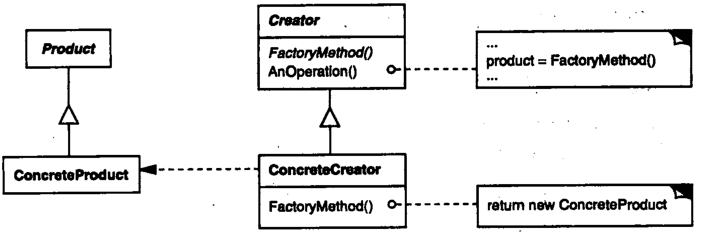
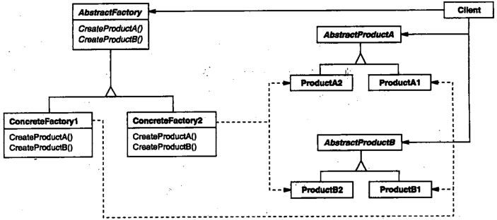
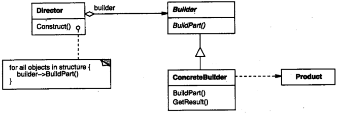

# 创建型设计模型

## 工厂方法 (FACTORY METHOD)

##### 使用场景

- Creator 只知道需要创建一个 ConcreteProduct, 但不知道创建哪一个 ConcreteProduct;
- 使用工厂方法将 ConcreteProduct 的实例化延迟到 ConcreteCreator, 通过实例化不同的 ConcreteCreator 实例化不同的 ConcreteProduct;

##### 结构

- Product 接口类: 声明 ConcreteProduct 需要实现的方法;
- ConcreteProduct 实例类: 实现 Product 的方法;
- Creator 接口类: 其方法用于返回一个 Product 实例;
- ConcreteCreator 实例类: 其方法返回一个 ConcreteProduct 实例;



##### 使用方法

- Creator 依赖标识符创建对应的 ConcreteProduct;

##### 示例代码

```typescript
// 创建 Product 接口类 Interviewer
interface Interviewer {
  askQuestions(): void;
}

// 创建 Interviewer 接口类的不同实现 ConcreteProduct
class Programmer implements Interviewer {
  askQuestions(): void {
    console.log("Asking about program.");
  }
}
class Farmer implements Interviewer {
  askQuestions(): void {
    console.log("Asking about farm.");
  }
}

// 创建 Creator 工厂方法类 HiringManager
class HiringManager {
  // Factory method
  protected makeInterviewer(): Interviewer;

  takeInterview(interviewer: string) {
    if (interviewer === "farmer") {
      return new Farmer();
    } else {
      return new Programmer();
    }
  }
}

const p = new HiringManager("farmer");
const f = new HiringManager("programmer");
p.askQuestions(); // Asking about program.
f.askQuestions(); // Asking about farm.
```

## 抽象工厂 (Abstract Factory)

##### 使用场景

- 仅提供创建类的方法而隐藏类的实现;
- 将多个相关的类放置于同一个抽象工厂中, 强调其一致性, 以便联合使用;
- 抽象工厂常借助于工厂方法实现;

##### 结构

- AbstractFactory(): 声明 ConcreteFactory 需要实现的方法;
- ConcreteFactory(): 实现 AbstractFactory 声明的方法, 用于创建一个具体的 product;
- AbstractProduct(): 声明 Product 需要实现的方法;
- Product(): 实现 AbstractProduct 声明的方法;
- Client(): 声明一个仅使用 AbstractFactory 和 AbstractProduct 的方法;



##### 使用方法

- 实例化 ConcreteFactory 类用于创建不同的 Product 实例;

##### 优缺点

- 优点;
  - 提供隐式创建 Product 的方法, 而无需显式使用 Product;
- 缺点;
  - AbstractFactory 声明的方法难以拓展, 增加新方法需要拓展所有 ConcreteFactory;

##### 示例代码

```typescript
// 创建 AbstractProduct 接口 Door
interface Door {
  getDescription(): void;
}
// 创建 Door 的不同实现 Product
class WoodenDoor implements Door {
  getDescription() {
    console.log("I am a wooden door");
  }
}
class IronDoor implements Door {
  getDescription() {
    console.log("I am an iron door");
  }
}

// 创建 AbstractProduct 接口 DoorExpert
interface DoorExpert {
  getDescription(): void;
}
// 创建 DoorExpert 的不同实现 Product
class Welder implements DoorExpert {
  getDescription() {
    console.log("I can only fit iron doors");
  }
}
class Carpenter implements DoorExpert {
  getDescription() {
    console.log("I can only fit wooden doors");
  }
}

// 创建 AbstractFactory 抽象工厂类 DoorFactory
interface DoorFactory {
  makeDoor(): Door;
  makeFittingExpert(): DoorExpert;
}

// 创建 DoorFactory 抽象工厂类的不同实现 ConcreteFactory
// 该抽象工厂类隐藏了 Door 和 DoorExpert 的具体实现
// 该抽象工厂类将 wooden 相关的 door 和 expert 放置一起
class WoodenDoorFactory implements DoorFactory {
  makeDoor(): Door {
    return new WoodenDoor();
  }
  makeFittingExpert(): DoorExpert {
    return new Welder();
  }
}

// 该抽象工厂类隐藏了 Door 和 DoorExpert 的具体实现
// 该抽象工厂类将 iron 相关的 door 和 expert 放置一起
class IronDoorFactory implements DoorFactory {
  makeDoor(): IronDoor {
    return new WoodenDoor();
  }
  makeFittingExpert(): DoorExpert {
    return new Carpenter();
  }
}

const wooden = new WoodenDoorFactory();
const woodenDoor = wooden.makeDoor();
const woodenExpert = wooden.makeFittingExpert();
woodenDoor.getDescription(); // I am a wooden door
woodenExpert.getDescription(); // I can only fit iron doors

const iron = new IronDoorFactory();
const ironDoor = wooden.makeDoor();
const ironExpert = wooden.makeFittingExpert();
ironDoor.getDescription(); // I am a wooden door
ironExpert.getDescription(); // I can only fit iron doors
```

## 生成器 (Builder)

##### 使用场景

- 将创建复杂类的逻辑, 独立于构建过程;
- 相同的构建过程可以创建不同的复杂类;

##### 结构

- Builder(): 声明 ConcreteBuilder 需要实现的方法;
  - 生成 Product 类的方法;
  - 返回 Product 类的方法;
- ConcreteBuilder(): 实现 Builder 的方法;
- Director(): 使用 Builder 实例的类;
- Product 类: ConcreteBuilder 创建的复杂类;



##### 使用方法

- 实例化 Builder 类;
- 实例化 Director 类, 向 Director 传递对应的 Builder 实例;
- Director 实例借助 Builder 创建并返回 Product;

##### 示例代码

```typescript
// 生成 Product 类 Computer
class Computer {
  cpu: string | null;
  gpu: string | null;

  constructor() {
    this.cpu = null;
    this.gpu = null;
  }

  getCpu() {
    console.log(this.cpu);
  }

  getGpu() {
    console.log(this.gpu);
  }
}

// 创建 Builder 接口 ComputerBuilder
interface ComputerBuilder {
  buildCpu(): void;
  buildGpu(): void;
  getComputer(): Computer;
}

// 创建 ComputerBuilder 接口不同实现 ConcreteBuilder
class HPBuilder implements ComputerBuilder {
  private computer: Computer;

  constructor(computer: Computer) {
    this.computer = computer;
  }

  buildCpu() {
    this.computer.cpu = "HP cpu";
  }
  buildGpu() {
    this.computer.gpu = "HP gpu";
  }

  getComputer(): Computer {
    return this.computer;
  }
}
class DellBuilder implements ComputerBuilder {
  private computer: Computer;

  constructor(computer: Computer) {
    this.computer = computer;
  }

  buildCpu() {
    this.computer.cpu = "Dell cpu";
  }
  buildGpu() {
    this.computer.gpu = "Dell gpu";
  }

  getComputer(): Computer {
    return this.computer;
  }
}

// 创建 Director 类 ComputerDirector
class ComputerDirector {
  private builder: ComputerBuilder;

  constructor(builder: ComputerBuilder) {
    this.builder = builder;
  }

  build() {
    this.builder.buildCpu();
    this.builder.buildGpu();

    return this.builder.getComputer();
  }
}

const hpBuilder = new HPBuilder(new Computer());
const hpDirector = new ComputerDirector(hpBuilder);
const hp = hpDirector.build();
hp.getCpu(); // hp cpu
hp.getGpu(); // hp gpu

const dellBuilder = new DellBuilder(new Computer());
const dellDirector = new ComputerDirector(dellBuilder);
const dell = dellDirector.build();
dell.getCpu(); // dell cpu
dell.getGpu(); // dell gpu
```

## 原型 (PROTOTYPE)

##### 原型

- 原型是一种特殊的类;
- 具有 clone() 方法用于返回自身的拷贝;

##### 使用场景

- 需要实例化的类在运行时中确定;
- 用户传递一个原型作为参数, 返回该原型的拷贝;

##### 结构

- Prototype(): 声明 ConcretePrototype 需要实现 clone() 方法;
- ConcretePrototype(): 实现 clone() 方法;
- Client(): 具有一个方法传递 Prototype 实例并返回其拷贝;


##### 示例代码

```typescript
// 创建 Prototype 接口 ComputerPrototype
interface ComputerPrototype {
  getName(): void;
  clone(): ComputerPrototype;
}

// 创建 ComputerPrototype 接口不同实现 ConcretePrototype
class HP implements ComputerPrototype {
  private _name: string;

  constructor(name: string) {
    this._name = name;
  }

  getName(): void {
    console.log("hp " + this._name);
  }

  clone(): ComputerPrototype {
    return new HP(this._name);
  }
}

class Dell implements ComputerPrototype {
  private _name: string;

  constructor(name: string) {
    this._name = name;
  }

  getName(): void {
    console.log("dell " + this._name);
  }

  clone(): ComputerPrototype {
    return new Dell(this._name);
  }
}

// 创建 Client 类 Computer, 其方法 getComputer 返回 ComputerPrototype 示例
class Computer {
  getComputer(prototype: ComputerPrototype): ComputerPrototype {
    return prototype.clone();
  }
}

const hp = new Computer().getComputer(new HP("computer"));
hp.getName(); // hp computer
const dell = new Computer().getComputer(new Dell("computer"));
dell.getName(); // dell computer
```

## 单例 (SINGLETON)

##### 使用场景

- 确保一个类仅有一个实例;

##### 结构

- Singleton(): 定义一个 Instance() 方法, 该方法全局仅会创建唯一实例;


##### 使用方法

- 仅能通过 Singleton 中的 Instance() 访问唯一实例;

##### 示例代码

```typescript
class Singleton {
  private static instance: Singleton;

  private constructor() {
    // ..
  }

  public static getInstance() {
    if (!Singleton.instance) {
      Singleton.instance = new Singleton();
    }

    return Singleton.instance;
  }
}

const instance0 = Singleton.getInstance();
const instance1 = Singleton.getInstance();
console.log(instance0 === instance1); // true
```
