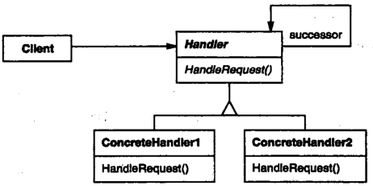
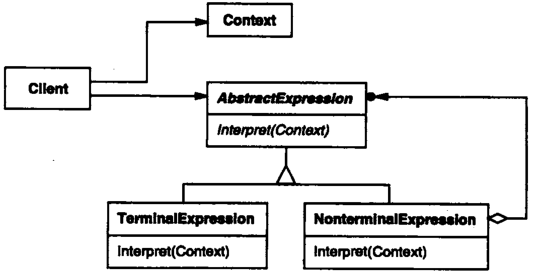
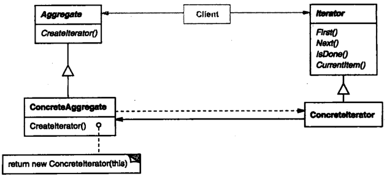
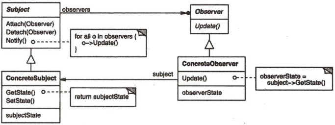
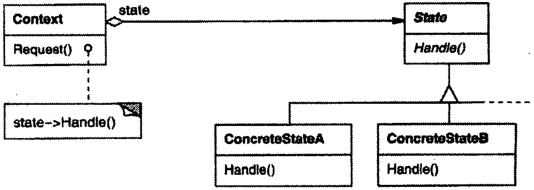
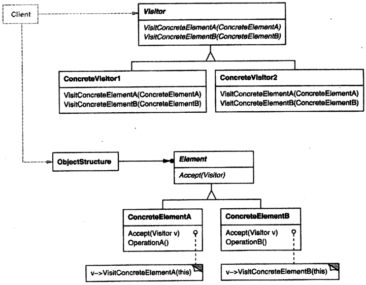

# 行为型设计模式

## 职责链 (CHAIN OF RESPONSIBILITY)

##### 使用场景

- 多个对象可以处理同一请求, 根据运行时动态确定对象;

##### 结构

- Handler: 处理请求的接口;
- ConcreteHandler;
  - 实现 Handler;
  - 若可以处理请求, 处理该请求, 反之转发给其后继者;
    - 定义 successor 属性存储后继者;



##### 使用方法

- 用户提交一个请求, 沿职责链传递, 直至一个 ConcreteHandler 处理该请求;

##### 示例代码

```typescript
// 创建 Handler 接口 Account
abstract class Account {
  protected _successor: Account | null;
  protected _name: string;
  protected _balance: number;

  constructor() {
    this._balance = 0;
    this._name = "account";
    this._successor = null;
  }

  setNext(account: Account) {
    this._successor = account;
  }

  // 若可以处理请求, 处理该请求, 反之转发给其后继者
  pay(amountToPay: number) {
    if (this.canPay(amountToPay)) {
      console.log(`Paid ${amountToPay} using ${this._name}`);
    } else if (this._successor) {
      console.log(`Cannot pay using ${this._name}. Proceeding...`);
      this._successor.pay(amountToPay);
    } else {
      console.log("None of the accounts have enough _balance");
    }
  }

  canPay(amount: number) {
    return this._balance >= amount;
  }
}

// Account 的具体实现
class Bank extends Account {
  constructor(balance: number) {
    super();
    this._name = "bank";
    this._balance = balance;
  }
}

class Paypal extends Account {
  constructor(balance: number) {
    super();
    this._name = "Paypal";
    this._balance = balance;
  }
}

class Bitcoin extends Account {
  constructor(balance: number) {
    super();
    this._name = "bitcoin";
    this._balance = balance;
  }
}

const bank = new Bank(100);
const paypal = new Paypal(200);
const bitcoin = new Bitcoin(300);

bank.setNext(paypal);
paypal.setNext(bitcoin);

// Cannot pay using bank. Proceeding...
// Cannot pay using Paypal. Proceeding...
// Paid 259 using bitcoin
bank.pay(259);
```

## 命令 (COMMAND)

##### 使用场景

- 用户使用不同的请求操作同一对象;
- 支持取消, 排队, 日志的操作;

##### 结构

- Command: 命令接口;
- ConcreteCommand;
  - Command 接口的具体实现;
  - 使用组合将一个 Receiver 作为其属性;
  - 其不同方法中将 Receiver 与其一个动作绑定;
- Invoker: 接受不同 Command , 基于 Command 的不同接口触发对应动作;
- Receiver;
  - 接受者;
  - 接受者具有自己的动作;


##### 使用方法

- Receiver 作为 ConcreteCommand 的一个属性;
- ConcreteCommand 实现具体命令;
- Invoker 接受不同的 ConcreteCommand, 通过 Command 的 Execute 动作提交请求;
- ConcreteConcreteCommand 对 Receiver 执行具体动作;

##### 示例代码

```typescript
// 定义 Receiver
class Bulb {
  turnOn() {
    console.log("Bulb has been lit!");
  }

  turnOff() {
    console.log("Darkness!");
  }
}

// 定义 Command 接口
interface Command {
  execute(): void;
  undo(): void;
  redo(): void;
}
// 实现 Command 接口
class TurnOn implements Command {
  // 存储 Receiver
  private _bulb: Bulb;

  constructor(bulb: Bulb) {
    this._bulb = bulb;
  }

  // 绑定 Receiver 与其动作
  execute(): void {
    this._bulb.turnOn();
  }

  undo(): void {
    this._bulb.turnOff();
  }

  redo(): void {
    this.execute();
  }
}
class TurnOff implements Command {
  private _bulb: Bulb;

  constructor(bulb: Bulb) {
    this._bulb = bulb;
  }

  execute(): void {
    this._bulb.turnOff();
  }

  undo(): void {
    this._bulb.turnOn();
  }

  redo(): void {
    this.execute();
  }
}

// 定义 Invoker
class RemoteController {
  // 接受不同 Command , 基于命令触发对应动作
  submit(command: Command) {
    command.execute();
  }
}

const bulb = new Bulb();
const turnOn = new TurnOn(bulb);
const turnOff = new TurnOff(bulb);
const remote = new RemoteController();

remote.submit(turnOn); // Bulb has been lit
remote.submit(turnOff); // Darkness!
```

## 解释器 (INTERPRETER)

##### 使用场景

- 解析自定义文法;

##### 结构

- AbstractExpression: 定义 AST 中抽象的解释操作;
- TerminalExpression: 定义终结符的操作;
- NonterminalExpression: 定义非终结符的操作;
- Context: 上下文信息;
- Client: 定义一个 AST;



##### 使用方法

- 详见编译原理;

##### 示例代码

- 详见编译原理;

## 迭代器 (ITERATOR)

##### 使用场景

- 迭代对象内部元素, 但又不暴露内部实现;
- 为多种不用的迭代对象提供同一接口;

##### 结构

- Iterator: 迭代器接口;
- ConcreteIterator: Iterator 接口的具体实现;
- Aggregate: 创建 Iterator 接口;
  - 可不实现;
- ConcreteAggregate: 实现 Aggregate 接口;



##### 使用方法

- 使用 ConcreteAggregate 创建 ConcreteIterator;
- 使用 ConcreteIterator 迭代对象;

##### 示例代码

```typescript
// 迭代对象
class RadioStation {
  protected _frequency: number;

  constructor(frequency: number) {
    this._frequency = frequency;
  }

  getFrequency(): number {
    return this._frequency;
  }
}

// 定义 Iterator 接口
interface Iterator<T> {
  first(): T | null;
  next(): T | null;
  isDone(): boolean;
  currentItem(): T | null;
}
// 实现 Iterator 接口
class RadioStationIterator implements Iterator<RadioStation> {
  protected _stations: RadioStation[];
  protected _counter: number;

  constructor(stations: RadioStation[]) {
    this._counter = 0;
    this._stations = stations;
  }

  currentItem(): RadioStation | null {
    if (this.isDone()) {
      return null;
    } else {
      return this._stations[this._counter];
    }
  }

  first(): RadioStation | null {
    if (this.isDone()) {
      return null;
    } else {
      return this._stations[0];
    }
  }

  next(): RadioStation | null {
    if (this.isDone()) {
      return null;
    } else {
      this._counter++;
      return this._stations[this._counter];
    }
  }

  isDone(): boolean {
    return (
      this._stations.length === 0 || this._counter === this._stations.length - 1
    );
  }
}

const stations = [
  new RadioStation(1),
  new RadioStation(2),
  new RadioStation(3),
  new RadioStation(4),
];

let iterator = new RadioStationIterator([]);
console.log(iterator.currentItem()); // null
iterator = new RadioStationIterator(stations);
console.log(iterator.currentItem()); // RadioStation { _frequency: 1 }
console.log(iterator.next()); // RadioStation { _frequency: 2 }
console.log(iterator.next()); // RadioStation { _frequency: 3 }
console.log(iterator.next()); // RadioStation { _frequency: 4 }
console.log(iterator.next()); // null
console.log(iterator.isDone()); // true
```

## 中介者 (MEDIATOR)

##### 使用场景

- 使用一个中介者封装不同对象之间的交互;
- 保证各对象之间的低耦合;

##### 结构

- Mediator: 定义中介者接口;
- ConcreteMediator: 实现 Mediator 接口;
- Colleague: 定义同事类接口;
  - 使用组合的方式将 Mediator 作为其属性;
- ConcreteColleague: 实现 Colleague 接口;


##### 使用方法

- Colleague 通过 Mediator 转发请求实现不同 Colleague 的协作;

##### 示例代码

```typescript
// 定义中介者接口
interface ChatRoomMediator {
  showMessage(user: User, message: string): void;
}
// 实现 Mediator 接口
class ChatRoom implements ChatRoomMediator {
  showMessage(user: User, message: string): void {
    console.log(`${user.getName()}: ${message}`);
  }
}

// 定义同事类接口
interface IUser {
  getName(): string;
  send(message: string): void;
}
// 实现 Colleague 接口
// 使用组合的方式将 Mediator 作为其属性
class User implements IUser {
  protected _name: string;
  protected _chatMediator: ChatRoomMediator;

  constructor(name: string, mediator: ChatRoomMediator) {
    this._chatMediator = mediator;
    this._name = name;
  }

  getName() {
    return this._name;
  }

  send(message: string): void {
    this._chatMediator.showMessage(this, message);
  }
}

const mediator = new ChatRoom();

const john = new User("john", mediator);
const Jake = new User("Jake", mediator);

john.send("Hello"); // john: Hello
Jake.send("Hey"); // Jake: Hey
```

## 备忘录 (MEMENTO)

##### 使用场景

- 不破坏封装性的前提下, 保存对象内部状态, 从而实现恢复机制;

##### 结构

- Memento: 存储对象内部状态;
- Originator: 原发器;
  - 创建一个备忘录;
  - 使用备忘录恢复内部状态;
- Caretaker: 备忘录管理者;
  - 只读备忘录;


##### 使用方法

- 向 Originator 发送请求, 创建 Memento, 并将 Memento 以组合形式传递给 Caretaker;
- 一定时间后, Originator 通过 Caretaker 读取的 Memento 恢复状态;

##### 示例代码

```typescript
// 备忘录
class Memento {
  public state: any;

  constructor(state: any) {
    this.state = state;
  }

  public getState() {
    return this.state;
  }
}

// 备忘录管理者
class Caretaker {
  private stack: Memento[] = [];

  public getMemento() {
    return this.stack.pop();
  }

  public addMemento(memoto: Memento) {
    this.stack.push(memoto);
  }
}

// 发起者
class Originator {
  private state: any;

  public getState() {
    return this.state;
  }

  public setState(state: any) {
    this.state = state;
  }

  public createMemoto() {
    return new Memoto(this.state);
  }

  public setMemoto(memoto: Memoto) {
    this.state = memoto.getState();
  }
}

const originator = new Originator();
const caretaker = new Caretaker();
originator.setState("hello world");
caretaker.setMemento(originator.createMento());
originator.setMemento(caretaker.getMemento());
```

## 观察者 (OBSERVER)

##### 使用场景

- 一个对象的状态发生改变, 依赖于他的对象得到通知并更新;

##### 结构

- Subject: 目标;
  - 提供注册和删除 Observer 的接口;
- ConcreteSubject: Subject 接口的具体实现;
- Observer: 观察者接口;
- ConcreteObserver: Observer 的具体实现;
  - 维护一个执行 ConcreteSubject 的引用;
  - 存储状态;
  - 通过 update 接口更新状态;



##### 使用方法

- Subject 注册到 Observer;
- ConcreteObserver 状态发生变化, 通知各个 ConcreteObserver 并更新;

##### 示例代码

```typescript
// Subject 接口
interface Subject {
  attach(observer: Observer): void;
  detach(observer: Observer): void;
  notify(): void;
}
// 实现 Subject 接口
class JobAgency implements Subject {
  private _observer: Set<Observer>;
  private _name: string[];

  constructor() {
    this._observer = new Set();
    this._name = [];
  }

  attach(observer: Observer): void {
    this._observer.add(observer);
  }

  detach(observer: Observer): void {
    this._observer.delete(observer);
  }

  notify(): void {
    for (const observer of this._observer) {
      observer.update(this);
    }
  }

  addJob(job: string) {
    this._name.push(job);
  }

  getJob() {
    return this._name;
  }
}

// Observer 接口
interface Observer {
  update(subject: Subject): void;
}
// 实现 Observer 接口
class JobSeek implements Observer {
  private _name: string[];

  constructor() {
    this._name = [];
  }

  update(subject: JobAgency): void {
    this._name = subject.getJob();
  }

  getJob() {
    return this._name;
  }
}

const jobAgency = new JobAgency();
const jake = new JobSeek();
const john = new JobSeek();

jobAgency.attach(jake);
jobAgency.attach(john);
console.log(jake.getJob()); // []
console.log(john.getJob()); // []

jobAgency.addJob("worker");
jobAgency.notify();
console.log(jake.getJob()); // [ 'worker' ]
console.log(john.getJob()); // [ 'worker' ]
```

## 状态 (STATE)

##### 使用场景

- 一个对象在其内部状态发生改变时改变其行为;

##### 结构

- Context: 环境, 保存 state 实例;
- State: 状态接口, 封装与 Context 一个特定状态的对应动作;
- ConcreteState: 实现 State 接口;



##### 使用方法

- Context 将于状态相关的请求委托到对应 ConcreteState;

##### 示例代码

```typescript
interface PhoneState {
  pickUp(state: PhoneState): PhoneState;
  hangUp(state: PhoneState): PhoneState;
  dial(state: PhoneState): PhoneState;
}

class PhoneStatePickUp implements PhoneState {
  pickUp(state: PhoneState): PhoneState {
    console.log("already picked up");
    return state;
  }
  hangUp(state: PhoneState): PhoneState {
    return new PhoneStateHangUp();
  }
  dial(state: PhoneState): PhoneState {
    return new PhoneStateDial();
  }
}

class PhoneStateHangUp implements PhoneState {
  pickUp(state: PhoneState): PhoneState {
    return new PhoneStatePickUp();
  }
  hangUp(state: PhoneState): PhoneState {
    console.log("already hang up");
    return state;
  }
  dial(state: PhoneState): PhoneState {
    console.log("unable to dial in hang up state");
    return state;
  }
}

class PhoneStateDial implements PhoneState {
  pickUp(state: PhoneState): PhoneState {
    console.log("already picked up");
    return state;
  }
  hangUp(state: PhoneState): PhoneState {
    return new PhoneStateHangUp();
  }
  dial(state: PhoneState): PhoneState {
    console.log("already dialing");
    return state;
  }
}

class Phone {
  private _state: PhoneState;

  constructor() {
    this._state = new PhoneStateHangUp();
  }

  pickUp() {
    this._state = this._state.pickUp(this._state);
  }
  hangUp() {
    this._state = this._state.hangUp(this._state);
  }
  dial() {
    this._state = this._state.dial(this._state);
  }
}

const phone = new Phone();
phone.dial(); // unable to dial in hang up state
phone.pickUp();
phone.dial();
phone.hangUp();
```

## 策略 (STRATEGY)

##### 使用场景

- 同一种行为有多种实现;

##### 结构

- Strategy: 策略接口;
- ConcreteStrategy: Strategy 接口的具体实现;
- Context: 上下文;
  - 使用组合将 Strategy 作为其属性;


##### 使用方法

- 通过工厂方法提供 Strategy;
- 基于委托依赖注入 Strategy 至 Context;
- Context 将用户请求转发给 Strategy;

##### 示例代码

```typescript
// 定义 Strategy 接口
interface SortStrategy {
  sort(dataset: number[]): number[];
}
// Strategy 接口的具体实现
class BubbleSortStrategy implements SortStrategy {
  sort(dataset: number[]): number[] {
    console.log("Sorting using bubble sort");
    return dataset.sort((a, b) => a - b);
  }
}
class QuickSortStrategy implements SortStrategy {
  sort(dataset: number[]): number[] {
    console.log("Sorting using quick sort");
    return dataset.sort((a, b) => a - b);
  }
}

// 定义 Context 接口
class Sorter {
  private _strategy: SortStrategy;

  constructor(strategy: SortStrategy) {
    this._strategy = strategy;
  }

  sort(dataset: number[]) {
    return this._strategy.sort(dataset);
  }
}

const smallDataset = [1, 3, 4, 2];
const bigDataset = [1, 4, 3, 2, 8, 10, 5, 6, 9, 7];
const sorter = new Sorter(new BubbleSortStrategy());
// Sorting using bubble sort
// [ 1, 2, 3, 4 ]
console.log(sorter.sort(smallDataset));

const sorter = new Sorter(new QuickSortStrategy());
// Sorting using quick sort
// [ 1, 2, 3, 4,  5, 6, 7, 8, 9, 10 ]
console.log(sorter.sort(bigDataset));
```

## 模板方法 (TEMPLATE METHOD)

##### 使用场景

- 抽象类实现不可变部分, 定义可变部分接口;
- 子类继承抽象类, 实现可变部分;

##### 结构

- AbstractClass: 定义抽象类;
- ConcreteClass: 定义具体类;


##### 使用方法

- ConcreteClass 实现 AbstractClass 定义的可变部分;

##### 示例代码

```typescript
// 定义 AbstractClass
abstract class Builder {
  // 不可变部分
  build() {
    this.test();
    this.lint();
    this.assemble();
    this.deploy();
  }
  // 可变部分
  abstract test(): void;
  abstract lint(): void;
  abstract assemble(): void;
  abstract deploy(): void;
}

// 定义具体类
class AndroidBuilder extends Builder {
  test() {
    console.log("Running android tests");
  }

  lint() {
    console.log("Linting the android code");
  }

  assemble() {
    console.log("Assembling the android build");
  }

  deploy() {
    console.log("Deploying android build to server");
  }
}
class IosBuilder extends Builder {
  test() {
    console.log("Running ios tests");
  }

  lint() {
    console.log("Linting the ios code");
  }

  assemble() {
    console.log("Assembling the ios build");
  }

  deploy() {
    console.log("Deploying ios build to server");
  }
}

const android = new AndroidBuilder();
const ios = new IosBuilder();

android.build();
// Running android tests
// Linting the android code
// Assembling the android build
// Deploying android build to server
ios.build();
// Running ios tests
// Linting the ios code
// Assembling the ios build
// Deploying ios build to server
```

## 访问者 (VISITOR)

##### 使用场景

- 对象结构基本不变, 但是对其定义新的操作;

##### 结构

- Visitor: 访问者接口;
  - 定义需要被访问的 element;
- ConcreteVisitor: Visitor 接口的具体实现;
- Element: 元素接口;
  - 定义 accept 操作接受 Visitor;
- ConcreteElement: Element 的具体实现;
- ObjectStructure: 对象接口;
  - 枚举所有 element;
  - 可不实现;



##### 使用方法

- 创建 Visitor, 使用 ObjectStructure 访问 Element;

##### 示例代码

```typescript
// 定义 Element 接口
interface Animal {
  accept(operation: AnimalVisitor): void;
}

// 实现 Element 接口
class Monkey implements Animal {
  shout() {
    console.log("Ooh oo aa aa!");
  }

  accept(operation: AnimalVisitor): void {
    operation.visitMonkey(this);
  }
}
class Lion implements Animal {
  roar() {
    console.log("Roaaar!");
  }

  accept(operation: AnimalVisitor): void {
    operation.visitLion(this);
  }
}
class Dolphin implements Animal {
  speak() {
    console.log("Tuut tuttu tuutt!");
  }

  accept(operation: AnimalVisitor): void {
    operation.visitDolphin(this);
  }
}

// 定义 Visitor 接口
interface AnimalVisitor {
  visitMonkey(monkey: Monkey): void;
  visitLion(lion: Lion): void;
  visitDolphin(dolphin: Dolphin): void;
}
// 实现 Visitor 接口
class Speak implements AnimalVisitor {
  visitMonkey(monkey: Monkey): void {
    monkey.shout();
  }
  visitLion(lion: Lion): void {
    lion.roar();
  }
  visitDolphin(dolphin: Dolphin): void {
    dolphin.speak();
  }
}

const monkey = new Monkey();
const lion = new Lion();
const dolphin = new Dolphin();
const speak = new Speak();

monkey.accept(speak); // Ooh oo aa aa!
lion.accept(speak); // Roaaar!
dolphin.accept(speak); // Tuut tuttu tuutt!
```
