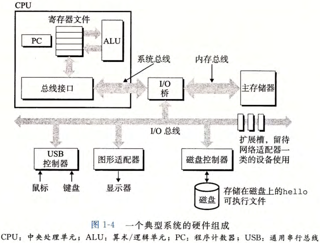
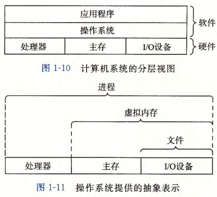

# 基础

## 文本文件和二进制文件

- 文本文件: 只由 ASCII 字符构成的文件;
- 二进制文件: 非文本文件;

## 编译系统

- 预处理器: 处理宏, 注释等;
- 编译器: 高级语言 - 汇编语言;
- 汇编器: 汇编语言 - 机器语言;
- 链接器: 合并多个程序;

## 硬件

### 系统硬件组成

- 总线: 传递定长的字节块;
  - 字: 字节块长度 (32/64 位);
- I/O: 输入/输出设备, 通过控制器与总线连接;
- 内存: 临时存储设备;
- CPU: 解释/执行内存中的指令;

## 操作系统

- 软件通过操作系统操作硬件;

## 并发

### 线程级并发

##### 线程级并发

- 构建在进程上的并发;

##### 多核处理器

- 将多个 CPU 集成在一个集成电路芯片上;

##### 超线程

- CPU 一个时钟周期中执行多个线程的技术;

### 指令级并行

- 处理器一个时钟周期执行多个指令;

### 单指令, 多数据并行

- 一条指令执行多个操作;
