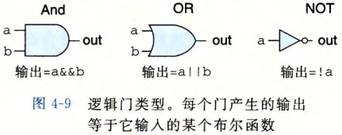
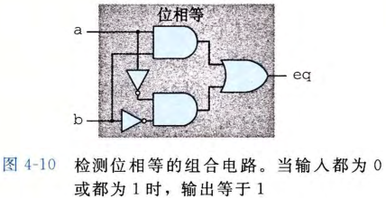
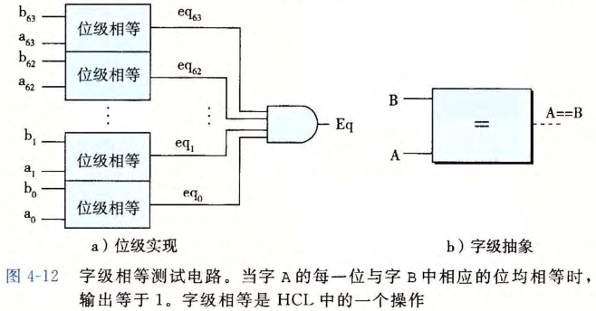
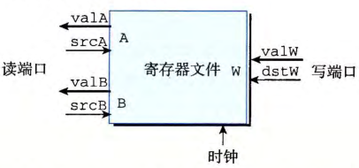
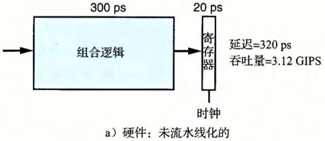
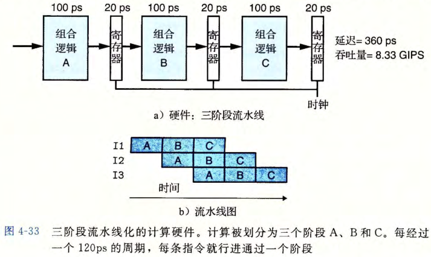
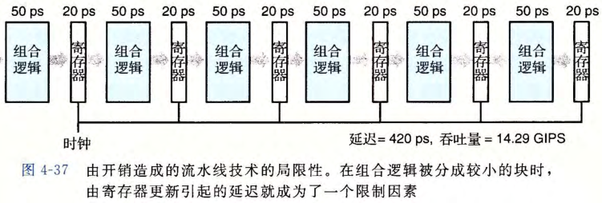

# 处理器体系结构

## 指令集体系结构

### 基本术语

##### 指令

- 一个或多个字节序列组成的二进制序列;

##### 指令集体系结构 (ISA)

- 处理器支持的指令;
- 指令的字节级编码;

### 可见状态

- 程序寄存器: 存储 64 位的字;
- 条件码 CC: 存储算术和逻辑信息;
- 程序计数器 PC: 当前执行指令的地址;
- 内存: 存储程序和数据;
- 状态码 Stat: 程序执行的总体状态信息;

### 指令

- 数据传送指令;
- 整数操作指令;
- 跳转指令;
- 条件传送指令;
- 调用指令;
- 出入栈指令;
- 停止指令;

### 指令编码

- 指令的字节级编码, 由若干字节组成;
  - 第一个字节表明指令类型;
- 指令具有唯一的指令编码;

### 异常

- 使用 Stat 状态码;

## 逻辑设计和硬件空间语言 HCL

### 逻辑门

- 数字电路的基本单元;
- 根据输入位的布尔函数参数输出;
  - 与/或/非;



### 组合电路和 HCL 布尔表达式

##### 组合电路

- 多个逻辑门组合成一个网;
- 构建约束;
  - 逻辑门的输入连接至系统输入, 存储器单元输出或逻辑门输出之一;
  - 多个逻辑门的输出不能连接在一起;
  - 无环图;



##### 多路复用器

- 根据输入控制信号的值;
- 从一组不同的数据信号中进行选择;

##### HCL 布尔表达式

- 表示组合电路的布尔表达式;

```c
(a && !a) && func(b,c)
```

### 字级的组合电路和 HCL 整数表达式

##### 字级的组合电路

- 对 "字" 进行操作的电路;



##### HCL 整数表达式

- 表示字级的组合电路的布尔表达式;

```c
word Out4 = [
    !s1 && !sO : A; # 00
    !s1  : B; # 01
    !s0  : C; # 10
    1    : D; # 11
];
```

##### 算术/逻辑单元(ALU)

- 进行算术运算和逻辑运算的组合电路;


### 存储器和时钟

##### 时序电路

- 具有状态的组合电路;

##### 时钟

- 周期性信号;
- 控制 PC, CC, 内存;
- 每个时钟周期, 程序计数器便会装载新的指令;

##### 存储器

- 存储电路状态信息, 使用始终控制;
  - 时钟寄存器 (寄存器): 根据时钟信号存储输入值;
  - 随机访问存储器 (内存): 存储多个字, 使用地址选择读写对应字;
    - 虚拟内存系统;
    - 寄存器文件: 存储机器寄存器地址;

##### 寄存器的差异

- 机器语言: 可寻址的字, 存储在寄存器文件中;
- 硬件: 组合电路的一部分, 存储电路状态信息;

##### 寄存器文件

- 存储机器寄存器;
- 读端口 + 写端口;
- 使用时钟控制读写;



## 顺序实现

### 处理指令

##### 流程

- 取指: 在内存中读取指令字节;
- 译码: 从寄存器文件读取操作数, 用于指令;
- 执行: ALU 执行指令对应操作;
- 访存: 读写内存;
- 写回: 写入结果值寄存器文件;
- 更新: 程序计数器更新地址;

##### 顺序实现

- 一条条的顺序执行指令;

### 硬件结构


### 时序

- 通过时钟控制处理器处理指令的操作顺序和时间间隔;

## 流水线的通用原理

### 优劣势

- 优势: 提高系统吞吐量;
- 劣势: 增加延迟;
  - 流水线寄存器的开销;

### 计算流水线

##### 延迟

- 执行一条指令的时间;

##### 吞吐量

- 延迟的倒数;

##### 非流水线化

- 一次计算执行完所有阶段后才进行下一次计算;



##### 流水线化

- 将一次计算分为若干阶段, 使用寄存器存储临时变量;
- 每经过一个时钟周期, 一个指令离开阶段 A, 进入阶段 B, 一个新指令进入阶段 A;



### 流水线的局限性

##### 不一致的划分

- 时钟周期取决于流水线中最慢的阶段;
- 导致其他阶段空闲若干时间;


##### 流水线过深

- 流水线过深;
- 流水线增加的寄存器开销大;



### 带反馈的流水线系统

- 一次计算产生的结果作为相同计算的输入参数;


