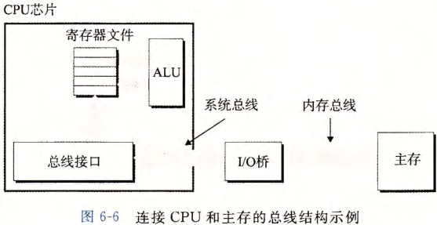
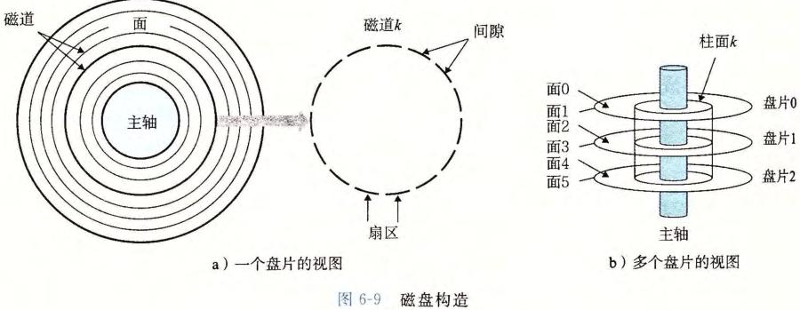
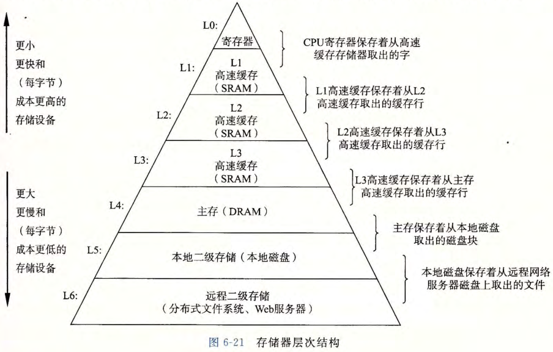

# 存储器层级结构

## 存储技术

### 随机访问存储器 (RAM)

##### 易失性存储器

- RAM 断电后丢失信息;

##### 静态 RAM (SRAM)

- 用于 CPU;
- 读取速度快, 空间小;

##### 动态 RAM (DRAM)

- 用于内存或显存;
- 内存大;

##### 内存控制器

- DRAM 芯片连接至称为内存控制器的组合电路, 用于读写 DRAM;

##### 内存模块

- DRAM 芯片封装在内存模块中;

### 总线

- 一组并行的导线, 用于在计算机系统不同部分传递信息;
- 分类;
  - 系统总线: 连接 CPU 和 I/O 桥;
  - 内存总线: 连接内存和 I/O 桥;
  - IO 总线: 连接 IO 和 I/O 桥;



### 只读存储器 (ROM)

- 断电后依旧保存信息;
- 部分 ROM 可读写, 只是叫做只读存储器;

#### 磁盘

##### 磁盘

- 速度慢, 存储空间大;

##### 磁盘构造

- 有若干盘片构成;
- 每个盘片有一组称为磁道的同心圆组成, 并划分为若干扇区;



##### 磁盘容量

- 记录密度: 单位磁道长度的位数;
- 磁道密度;
- 面密度;

##### 磁盘操作

- 寻道: 移动至指定磁道;

##### 逻辑磁盘块

- 若干个扇区构成一个逻辑块;

#### 固态硬盘

- 若干个闪存和一个闪存翻译层构成;
- 读写速度块;
- 寿命低;


## 局部性

### 基本术语

##### 局部性原理

- 计算机程序倾向于引用最近引用过的数据项;

##### 分类

- 时间局部性: 被引用过的内存位置很可能在不久后被引用;
- 空间局部性: 一个内存位置被引用, 其临近的位置很可能在不久后被引用;

### 程序数据引用的局部性

- 重复引用相同变量的程序具有良好的时间局部性;
- 具有步长的程序, 步长越短, 空间局部性越好;
- 局部性越好的程序运行速度越快;

### 编写高速缓存友好的代码

- 注意力集中于函数中的循环中;
- 对于数组等连续存储的数据结构, 根据其内存地址顺序依次访问;

```typescript
// 多维数组使用行顺序进行存储
int sumarrayrows (int a [M] [NJ)
{
    inti, j, sum= 0;
    for (i = 0; i < M; i ++)
        for (j = O; j < N; j++)
            sum += a[i] [j];
    return sum;
}
```

## 存储器层级结构

### 存储器层级结构



### 缓存

##### 高速缓存 (cache)

- 相对小而快速的存储设备;
- k 层作为 k+1 层的缓存;
- 数据通过块 (block) 的形式在两层之间传递;

##### 缓存命中

- k+1 层的数据刚好缓存在 k 层中;

##### 缓存不命中

- k+1 层的数据没有缓存在 k 层中;
- 具有在 k+1 层中读取数据并覆盖 k 层;
  - 随机替换策略;
  - 最少使用替换策略;

## 高速缓存存储器 (SRAM)

##### SRAM

- 位于 CPU 和内存之间的缓存;
- 分为 L1/L2/L3...;

##### 性能指标

- 不命中率;
- 命中率;
- 命中时间: 从高速缓存传输一个字到 CPU 的时间;
- 不命中惩罚;
