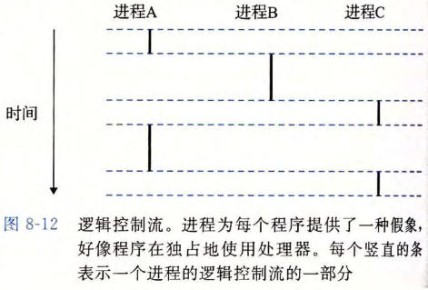
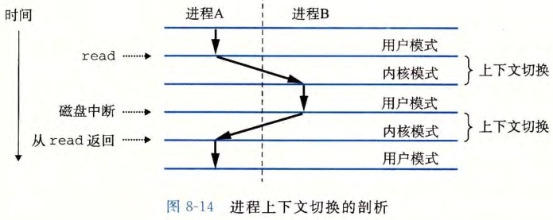

# 异常控制流

## 基本术语

##### 异常

- 控制流中的突变;
- 响应处理器状态的变化;

##### 异常类别

- 异步;
  - 中断: I/O 设备的异步信号;
- 同步;
  - 陷阱: 故意而为的异常, 连接应用程序和系统内核, 即系统调用;
  - 故障: 可恢复的错误;
  - 终止: 不可恢复的错误;

##### 控制流

- 一条指令到另一条指令的转移序列;

##### 异常控制流 (ECF)

- 通过异常使控制流突变;
- 应对系统状态的变化;

## 信号

##### 信号

- 异常的软件形式;
- 一种信号对应一个系统事件;

##### 流程

- 发送信号: 发送信号给目标进程;
- 接受信号: 目标进程接收信号, 执行对应事件处理程序;

## 进程

##### 进程

- 一个执行程序的实例;
- 程序运行在某进程的上下文中;
- 使用 pid 标识;

##### 逻辑控制流 (逻辑流)

- 进程给予程序一种假想, 即程序独占处理器;
- CPU 使用 PC 轮流处理进程;
- PC 值序列称为逻辑控制流;
- 一个逻辑流对应一个进程;

##### 并发流

- 一个逻辑流与另一个逻辑流重叠;

##### 并发

- 多个流并发执行的现象;

##### 私有地址空间

- 进程给予程序一种假想, 即程序独占内存;
- 进程为每个程序提供自己的私有地址空间;
  - 无法被其他进程读写;

##### 用户模式和内核模式

- 用于限制程序可以执行的指令, 以及可以访问的内存地址空间范围;
- 分类;
  - 内核模式: 可以执行指令集中的任何指令;
  - 用户模式: 无法直接控制内核, 只能通过系统调用接口间接控制;

##### 异常与内核模式

- 应用程序初始在用户模式中;
- 发生异常变为内核模式处理异常;
- 处理完毕后返回用户模式;

##### 上下文切换

- 每个进程维护一个上下文, 存储进程状态;
- 内核通过调度器, 基于 "上下文切换" 从一个进程跳转至另一个进程;
- 进行上下文切换时系统临时切换至内核模式;

##### 僵死进程

- 进程已经终止, 但未被内核清除, 处于一种已终止的状态;
- 等待父进程回收;
- 终止但未回收的进程称为僵死进程 (zombie);

##### 进程组

- 每个进程属于一个进程组;
- 子进程属于父进程的进程组;
- 进程组使用 gid 标识;
