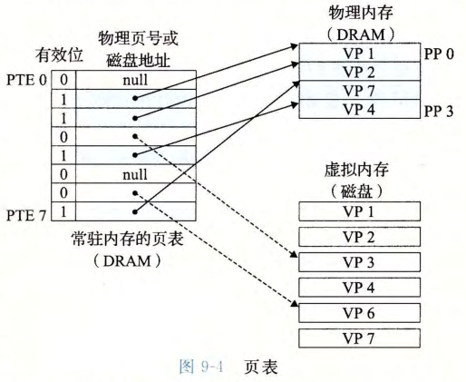
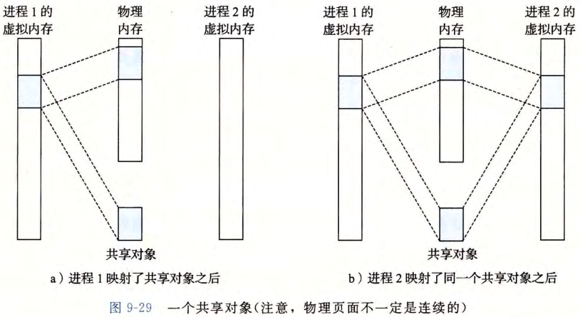
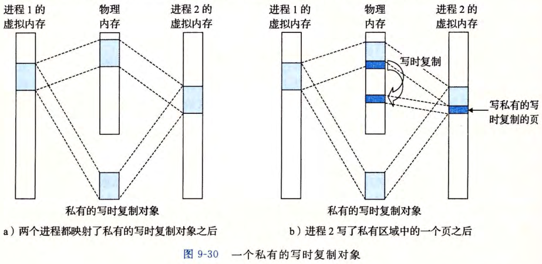

# 虚拟内存

## 虚拟内存

##### 虚拟内存

- 内存的抽象;
- 为进程提供私有内存空间;
- 若干连续的字节组成的数组, 存储在磁盘中;
- 每个字节对应唯一的虚拟地址, 作为数组的索引;

##### 页

- 类似于存储器层次结构中的块, 作为磁盘和内存之间的传输单元;
- 虚拟内存中称其为虚拟页;
- 物理内存中称其为物理页 (帧);

##### 虚拟页的状态

- 未分配: 未创建的页;
- 缓存: 缓存在物理内存中的已分配页;
- 未缓存: 未缓存在物理内存中的已分配页;

##### 页表 (PTE)

- 存储物理页号或者磁盘地址;
  - 缓存: 存储物理页号;
  - 未缓存: 存储磁盘地址;
- MMU 通过页表完成地址翻译;

##### 页命中和缺页

- 页命中: 页已被内存缓存;
- 缺页: 页未被内存缓存;

##### 内存保护功能

- 通过页表实现内存的访问控制功能;

## 物理和虚拟寻址

### 地址空间

- 非负整数地址的有序集合;
- 计算机的字长决定其大小;

### 物理地址和物理寻址

- 内存是若干连续的字节组成的数组;
- 每一个字节对应一个唯一的物理地址;
- CPU 使用物理地址访问内存称作物理寻址;

### 虚拟地址和虚拟寻址

- CPU 生成虚拟地址访问内存;
- 通过 CPU 上的内存管理单元 (MMU) 翻译为物理地址;
  - MMU 使用查询表进行两者的映射;

### 地址翻译

##### 地址翻译

- 虚拟地址空间到物理地址空间的映射;

##### 页命中流程

- CPU 生成虚拟地址, 并传递至 MMU;
- MMU 生成 PTE 地址, 并传递至内存;
- 内存返回 PTE 对应数据;
- MMU 构造物理地址, 并传递至内存;
- 内存返回对应数据至 CPU;

##### 缺页流程

- CPU 生成虚拟地址, 并传递至 MMU;
- MMU 生成 PTE 地址, 并传递至内存;
- 内存返回 PTE 对应数据;
- MMU 触发缺页异常处理程序, 将缺页缓存至内存;
- CPU 将缺页虚拟地址发送给 MMU, 进入页命中流程;

##### 多级页表

- 使用多级页表用于压缩页表;
- 上级页表的 PTE 负责映射下级页表;

## 内存映射和内存分配

##### 内存映射

- 将虚拟内存区域与磁盘某对象关联;
  - 普通文件
  - 匿名文件;
- 虚拟内存一旦初始化, 通过内核维护的交换文件 (swap file) 交换处理;

##### 共享对象

- 共享对象的物质内存空间被多个进程的虚拟内存空间映射;
- 一个对象对于共享对象的操作, 对于其他进程是可见的, 同时修改磁盘上的原始对象;

##### 私有对象

- 私有对象的物质内存空间被多个进程的虚拟内存空间映射;
- 一个对象对于私有对象的操作, 对于其他进程是不可见的, 不会修改磁盘上的原始对象;
- 私有对象使用 "写时复制" 的机制防止原始对象的改变;

##### 动态内存分配

- 动态内存分配器维护一个进程的虚拟内存区域, 称作堆;
- 堆是一组不同大小块的集合, 用于程序的内存分配;
- 用于运行时的内存分配;
- 效率相对于栈较慢;
