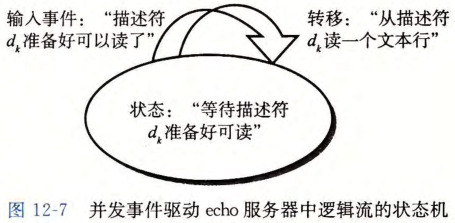
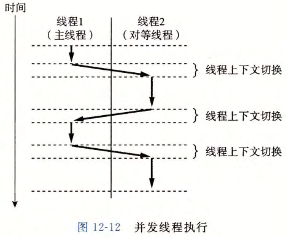
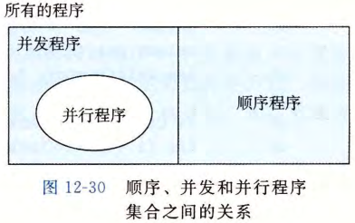

# 并发编程

## 基于进程的并发编程

##### 流程

- 父进程接受请求;
- 父进程创建子进程提供服务;

##### 特点

- 父子进程共享文件表, 不共享用户地址空间;
- 父子通信需要使用 IPC 机制, 开销大;

## 基于 I/O 多路复用的并发编程

##### I/O 多路复用技术

- 内核挂起进程;
- 经过若干个 I/O 事件发生后;
- 将控制返回给从应用程序;

##### 并发事件驱动

- 将逻辑流转换为状态机;
  - 状态机: 一组状态, 输入事件和转移的集合;
  - 转移是将 (输入状态, 输入事件) 映射到输出状态;
- 使用 I/O 多路复用, 当描述符可读时时, 对状态机进行转移;

##### 优劣势

- 优势: 运行于单一进程上下文, 每个逻辑流能访问该进程所有地址空间;
- 缺点: 代码复杂;

## 基于线程的并发模式

### 线程

##### 线程

- 运行在进程上下文的逻辑流;
- 每个线程具有自己的线程上下文;
- 共享进程上下文;

##### 线程执行模型

- 主线程: 进程开始时的线程;
- 对等线程: 区别于主线程的其他线程;
- 通过线程上下文切换调度不同线程, 切换速度快于进程上下文切换;
- 同一进程线程池中的线程是并列关系;

### 同步

##### 同步错误

- 多个线程操作同一共享变量;
- 由于 CPU 指令顺序的不确定性, 结果未知;

##### 进度图

- 将 n 个线程的执行模型转换为 n 维笛卡尔空间的轨迹线;
- 不会引起同步错误的轨迹线称为安全轨迹线;

##### 信号量

- 用于生成进度图中的安全轨迹线;

##### 顺序程序, 并发程序和并行程序

- 顺序程序: CPU 顺序执行指令;
- 并发程序;
  - 逻辑流时间上重叠的程序;
- 并行程序: 多核并行调度并行线程;

### 并发问题

##### 线程安全函数

- 多个并发线程调用线程安全函数;
- 总会得到正确结果;

##### 可重入性

- 被多个并发线程调用时;
- 不会共享任何函数内部数据的线程安全函数;

##### 竞争

- 一个线程要在另一个线程到达 y 点之前, 要求到达自己控制流的 x 点;
- 该现象称为竞争;

##### 死锁

- 由于信号量机制;
- 线程被堵塞, 等待一个永远不会为真的条件;
