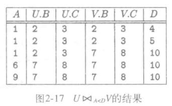

# 关系数据模型

## 数据模型概述

### 关系数据模型

- 基于表的数据模型;

### 半结构化数据模型

- 基于树或图的数据模型;
- 如 XML;

## 关系模式

### 基本术语

- 关系: 二维表;
- 列: 关系的列;
- 模式: 关系名极其属性的集合;
- 元组: 关系中处属性行之外的其他行;
- 分量: 元组中的对应属性值;
- 域: 分量的类型;
- 实例: 给定关系中元组的集合;
- 键: 定义在键上的属性值唯一;

### SQL 中的关系

- 表: 存储的关系, 用于能对其元组进行查询和更新;
- 视图: 通过计算定义的关系;
- 临时表: 执行 SQL 是临时构造;

### 数据类型

- 可变长度/固定长度字符串;
- 可变长度/固定长度位串;
- 布尔值;
- 整数类型;
- 浮点类型;
- 日期;
- 时间;

### 修改关系模式

- crud;
  - create;
  - read;
  - update;
  - delete;

### 键的声明

- 键的属性值唯一;
  - PRIMARY KEY: 属性值不能为 NULL;
  - UNIQUE: 属性值可以为 NULL;

## 代数查询语言

### 关系代数概述

- 关系操作: 交/并/差;
- 去除行/列的操作: 选择/投影;
- 组合元组的操作: 笛卡尔积/连接;
- 重命名操作;

### 集合操作

- 设两个关系 R 和 S;
- 并: 结果元素来自 R 或 S;
- 交: 结果元素 R 和 S 都存在;
- 差: R - S 为 R 中存在但 S 中不存在;

### 投影

- $\pi$
- 从关系 R 生成新关系 S;
- S 只包含 R 的部分列;

### 选择

- $\sigma_C$;
- 从关系 R 中生成一个 R 的元组的子集;

### 笛卡尔积

- 设两个关系 R 和 S;
- R 和 S 的笛卡尔积 ($R \times S$) 是一个有序对的集合;
  - 有序对的前半部分是 R 中的任一元组;
  - 有序对的后半部分是 S 中的任一元组;

### 自然连接

- 设两个关系 R 和 S;
- R 和 S 的自然连接 ($R \Join S$) 将 R 和 S 的所有共有属性且属性值相同的元组配对;

### $\theta$ 连接

- 设两个关系 R 和 S;
- R 和 S 满足条件 C 的 $\theta$ 连接 ($R \Join_C S$);
  - 首先得到 R 和 S 的笛卡尔积;
  - 从笛卡尔积寻找满足条件 C 的元组;

### 命名和重命名

- 修改属性名;

### 操作之间的联系

- 一些关系代数操作可以使用其他关系代数操作表示;
- 六个操作无法被其他操作表示;
  - 并/差/选择/投影/笛卡尔积/重命名;

$$R \cap S = R-(R-S)$$
$$R \Join_C S = \sigma_C(R\times S)$$
$$R \Join S = \pi_L(\sigma_C(R\times S))$$

## 关系上的约束

##### 引用完整性约束

- 规定某个关系出现的所有元组必须在另外一个关系出现;

##### 键约束

- 关系任意元组键上的属性值不同;

##### 其他约束

- 域约束;
  - 属性值的类型约束;
  - 属性值的长度约束;
  - 属性值的取值约束;
- ...;
