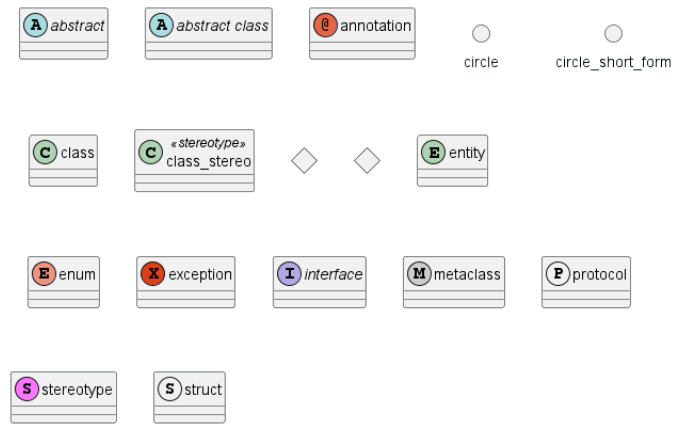
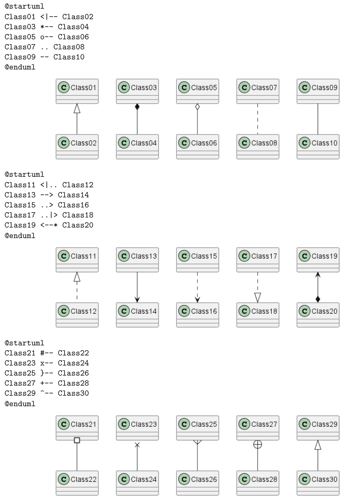
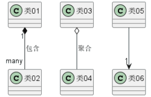
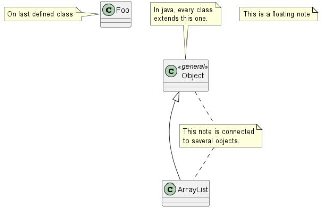

# PlantUML

## 类图

### 元素声明

```
@startuml
abstract  abstract
abstract class  "abstract class"
annotation  annotation
circle  circle
()  circle_short_form
class  class
class  class_stereo  <<stereotype>>
diamond  diamond
<>  diamond_short_form
entity  entity
enum  enum
exception  exception
interface  interface
metaclass  metaclass
protocol  protocol
stereotype  stereotype
struct  struct
@enduml
```



### 关系



### 关系标签

- 关系类型在符号两边使用 "";
- 关系说明在 : 后接说明

```
@startuml
类01 "1" *-- "many" 类02 : 包含
类03 o-- 类04 : 聚合
类05 --> "1" 类06
@enduml
```



### 属性和方法

##### 属性和方法

```
@startuml
class Dummy {
String data
void methods()
}

class Dummy {
{field} A field (despite parentheses)
{method} Some method
}
@enduml
```

##### 可访问性

- +: 公共;
- #: 保护;
- -: 私有;

```
class Dummy {
-field1
#field2
+method2()
}
@enduml
```

##### 静态和抽象

```
@startuml
class Dummy {
{static} String id
{abstract} void methods()
}
@enduml
```

### 备注

##### 类

- 类的声明末尾;
- note left/right/top/bottom of 添加备注;

##### 链接

- 使用 note (left/right/top/bottom) on link 关机找你;

```
@startuml
class Dummy
Dummy --> Foo : A link
note on link #red: note that is red
Dummy --> Foo2 : Another link
@enduml
```

##### 单独使用

- 单独使用 note 关键字;
- .. 符号链接其他对象

```
@startuml
class Object << general >>
Object <|--- ArrayList
note top of Object : In java, every class\nextends this one.
note "This is a floating note" as N1
note "This note is connected\nto several objects." as N2
Object .. N2
N2 .. ArrayList
class Foo
note left: On last defined class
@enduml
```



### 包

- 使用 package 关键字;

```
@startuml
package "Classic Collections" #DDDDDD {
Object <|-- ArrayList
}
package net.sourceforge.plantuml {
Object <|-- Demo1
Demo1 *- Demo2
}
@enduml
```


## 思维导图

### MarkDown 语法

```
@startmindmap
- root node
- some first level node
- second level node
- another second level node
- another first level node
@endmindmap
```

### 图形方向

- 右方向: +;
- 左方向 -;

```
@startmindmap
+ OS
++ Ubuntu
+++ Linux Mint
++ LMDE
++ SolydXK
-- Windows NT
--- Windows 8
@endmindmap
```

### 多行表示

- : 和 ; 包裹;

```python
@startmindmap
* Class Templates
**:Example 1
<code>
template <typename T>
class cname{
void f1()<U+003B>
...
}
</code>
;
```

### 多个根节点

- 多个 \*;

```
@startmindmap
* Root 1
** Foo
** Bar
* Root 2
** Lorem
** Ipsum
@endmindmap
```

### 移除外部方框

- \*/+/- 后使用 \_;

```
@startmindmap
*_ root node
**_ some first level node
***_ second level node
***_ another second level node
***_ foo
***_ bar
***_ foobar
**_ another first level node
@endmindmap
```
